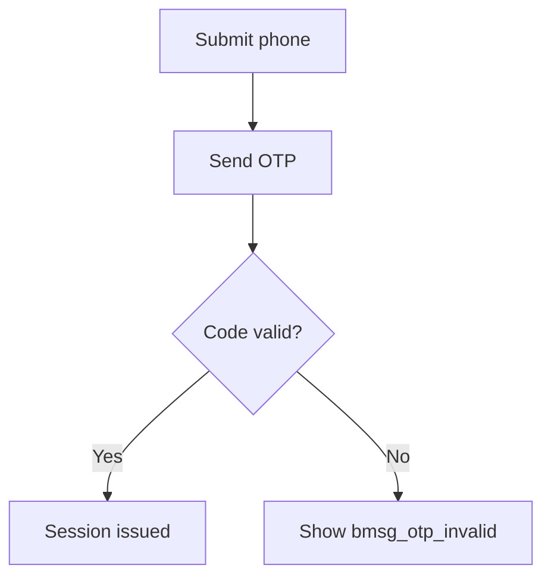
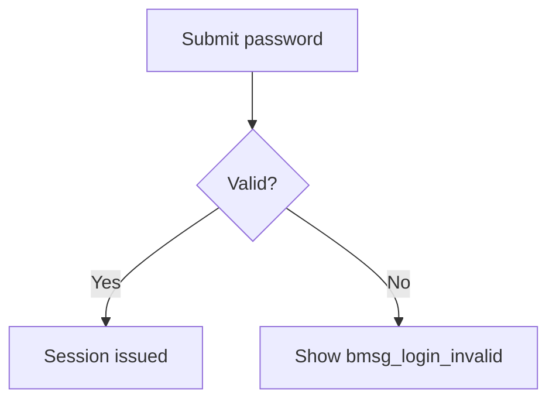
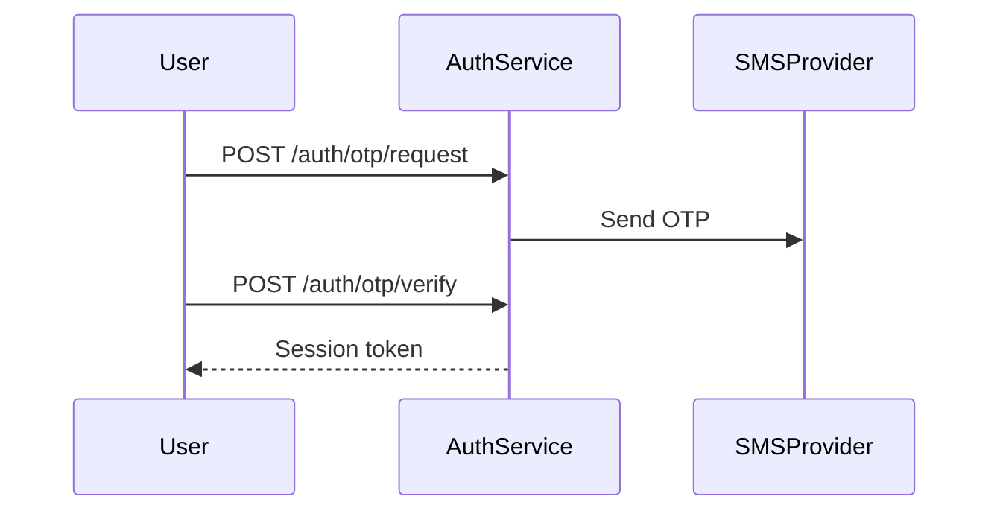
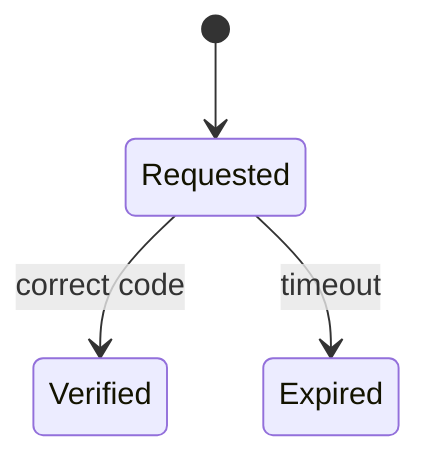

# Business Flow — <short title>

## Flow Overview <!-- required -->
<!-- One line: describe the end-to-end flow this document covers. -->
- User requests an OTP, receives it by SMS, and submits it to complete login.

## To-Be Flowchart <!-- required -->
<!-- One Mermaid flowchart showing the target-state flow. -->

## As-Is Flowchart
<!-- Include only for enhancement and refactor work; show the current-state flow being changed. -->

## Sequence Diagrams <!-- required -->
<!-- One Mermaid sequence diagram per key interaction between actors/systems. -->

## State Diagrams <!-- required -->
<!-- One Mermaid state diagram per entity with meaningful lifecycle states. -->

## Business Rules <!-- required -->
<!-- One row per rule with the requirement/story it implements and where it is enforced. -->
| ID | rule | refs | enforced in |
|---|---|---|---|
| BR-001 | OTP expires 5 minutes after issuance | [FR-001] | auth-service |

## Edge Cases <!-- required -->
<!-- One row per edge case with its trigger and expected behavior. -->
| case | trigger | expected behavior | refs |
|---|---|---|---|
| OTP resent before expiry | user requests new code while one is active | previous code is invalidated | [BR-001] |
