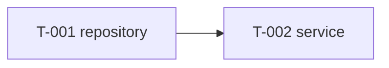

# Plan — <short title>

## Tasks <!-- required -->
<!-- One row per task; one layer per task; sizes S/M/L. -->
| ID | layer | title | story refs | files/areas | depends_on | size | done criteria | test expectations |
|---|---|---|---|---|---|---|---|---|
| T-001 | backend | Add OTP repository with cache-backed store | [US-001] | apps/auth-service/internal/otp | none | M | VerifyOTP returns hit/miss correctly | table-driven unit tests for hit, miss, expiry |

## Dependency Order <!-- required -->
<!-- An ordered list plus a Mermaid graph of task dependencies. -->
1. T-001 (repository) before any service/handler task depending on it.

## Coverage <!-- required -->
<!-- One row per US; every US in stories.md must appear. -->
| US | tasks |
|---|---|
| US-001 | T-001 |

## Notes
<!-- Explain any non-obvious ordering rationale, e.g. why a task is split or sequenced early. -->
- Repository task is first because service and handler tasks both depend on its interface.
