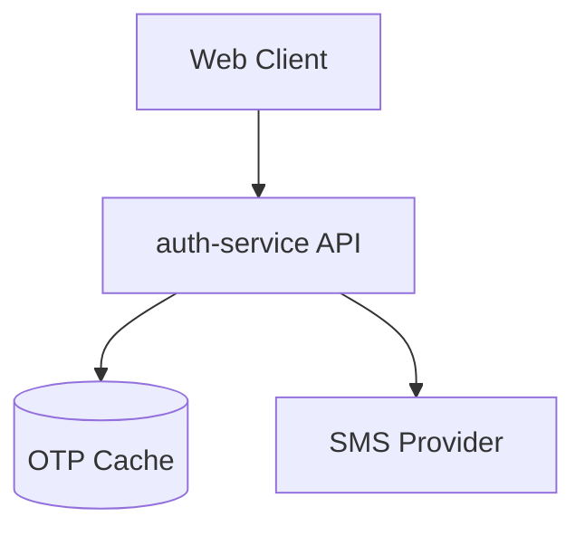
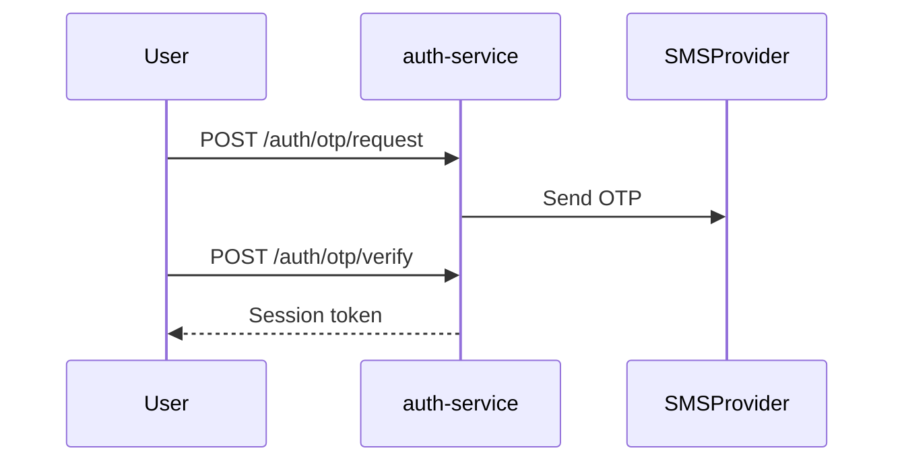

# Tech Spec — <short title>

## Context <!-- required -->
<!-- One line: what this spec covers and which FRs it implements. -->
- Implements SMS OTP login (FR-001) replacing password authentication in auth-service.

## Architecture Diagrams <!-- required -->
<!-- One C4-style container diagram and one sequence diagram for the main flow. -->

## FR → Component Mapping <!-- required -->
<!-- One row per FR; every FR in prd.md must appear here. -->
| FR | component | file/package | notes |
|---|---|---|---|
| FR-001 | OTP handler | apps/auth-service/internal/otp | issues and verifies codes |

## Layering <!-- required -->
<!-- One bullet per layer touched, per .jarvis/standards/structure.md. -->
- handler → service → repository, per `.jarvis/standards/structure.md`; no cross-layer calls.

## API Changes <!-- required -->
<!-- One row per endpoint changed or added; api-contract.yaml is the authoritative OpenAPI delta. -->
| method | path | auth | request | response | timeout | rate limit |
|---|---|---|---|---|---|---|
| POST | /auth/otp/verify | none (pre-session) | `{phone, code}` | `{token}` | 2s | 5/min/phone |

See `api-contract.yaml` for the full OpenAPI 3 delta.

## Data Design <!-- required -->
<!-- No JOIN / no $lookup — state denormalization or batched two-step fetch per read path. -->
| read path | source | strategy | why |
|---|---|---|---|
| verify OTP | mongo `otp_codes` | single-key lookup by `phone` | one collection, no join needed |

## Query-Index Matrix <!-- required -->
<!-- Every read/write path with its supporting index; this table is mirrored into docs/architecture/query-index-matrix.md. -->
| path/endpoint | db | query shape | sort | index | evidence |
|---|---|---|---|---|---|
| POST /auth/otp/verify | mongo | find by `phone` | none | `{phone:1}` unique | explain: IXSCAN |

## Cache Design <!-- required -->
<!-- One row per cache key. -->
| key | value | ttl | jitter | invalidated by | stampede protection |
|---|---|---|---|---|---|
| `otp:{phone}` | hashed code | 60s | ±5s | successful verify | single-flight lock |

## Validation Rules <!-- required -->
<!-- One row per input field. -->
| field | type | length | format | range | enum | sanitization |
|---|---|---|---|---|---|---|
| code | string | 6 | digits only | n/a | n/a | strip whitespace |

## Error Codes <!-- required -->
<!-- One row per new registry entry. -->
| internal code | public key | http | level | when |
|---|---|---|---|---|
| ERR_OTP_EXPIRED | bmsg_otp_invalid | 401 | warn | code found but past validity window |

## Logging Plan <!-- required -->
<!-- One row per event logged at an error boundary or key transition. -->
| event | level | component | fields |
|---|---|---|---|
| otp_verify_failed | warn | otp handler | request_id, phone_hash, reason |

## Complexity Notes <!-- required -->
<!-- One row per non-trivial algorithm, with Big-O. -->
| function | complexity | input bound | note |
|---|---|---|---|
| VerifyOTP | O(1) | single record lookup | indexed key lookup, no scan |

## Security <!-- required -->
<!-- One row per endpoint. -->
| endpoint | authn | authz rule | sensitive data | rate limit |
|---|---|---|---|---|
| POST /auth/otp/verify | none (issues session) | none pre-auth | phone number | 5/min/phone [SEC-07] |

## Performance Budget <!-- required -->
<!-- One row per path; budgets come from jarvis.config.yaml. -->
| path | budget | source | how measured |
|---|---|---|---|
| POST /auth/otp/verify | p95 < 200 ms at 50 rps | jarvis.config.yaml | k6 load test |

## Risks <!-- required -->
<!-- One row per risk with mitigation. -->
| ID | risk | mitigation |
|---|---|---|
| R-001 | SMS provider outage blocks all logins | fallback to email OTP |

## Alternatives <!-- required -->
<!-- One row per option rejected, with the reason. -->
| option | rejected because |
|---|---|
| Store OTP in MySQL with a JOIN to users table | violates no-JOIN rule [DB-01]; denormalized phone key is sufficient |

## ADRs <!-- required -->
<!-- One row per significant decision or standard exception this spec relies on. -->
| ADR | decision | rule exception |
|---|---|---|
| ADR-0007 | cache-back OTP store instead of a durable table | none |
