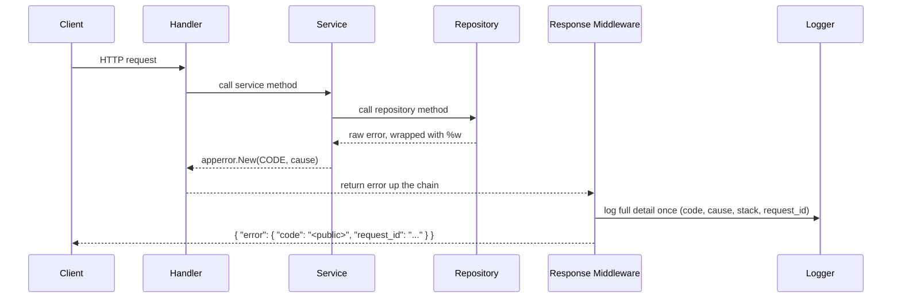

# Error Handling Standards
Purpose: guarantee no internal detail ever reaches a client while every failure is fully logged once.
Scope: `apps/api/**` (repositories, services, handlers, middleware), `packages/errors/**`, and any
frontend code that renders an API error. Does not cover envelope shape itself (`api.md`) or log
transport/format (`logging.md`) — only what goes into `error.code` and when.

## Registry

`packages/errors/registry.yaml` is the single source of truth for every error a client can receive.
No handler or service may use a string literal error code — only generated constants from this file.

| field | type | meaning |
|---|---|---|
| `code` | string | internal code, `UPPER_SNAKE`, unique repo-wide |
| `public` | string | safe key returned to the client in `error.code` |
| `http` | int | HTTP status the middleware sets for this code |
| `level` | `error` \| `warn` \| `info` | log level when this code fires |
| `description` | string | one line, for humans reading the registry, never sent to the client |

Full seed example:

```yaml
- code: INTERNAL_ERROR        # internal, unique, UPPER_SNAKE
  public: bmsg_error          # safe key returned to client
  http: 500
  level: error
  description: Unexpected failure
- code: USER_NOT_FOUND
  public: bmsg_error
  http: 404
  level: warn
  description: User id not found in repository
- code: VALIDATION_FAILED
  public: bmsg_validation_error
  http: 400
  level: info
  description: Request failed validation
- code: OTP_INVALID
  public: bmsg_otp_invalid
  http: 400
  level: info
  description: OTP mismatch or expired
```

`INTERNAL_ERROR` / `bmsg_error` is the mandatory fallback row; it must always exist and stays first.

## Rules

### ERR-01 — Raw error returned to client (MUST)
A handler or middleware must never write `err.Error()`, a driver/SQL message, or any Go error string
into the response body — the client sees only the mapped `public` key from the registry.

✅
```go
func (m *ErrorMiddleware) writeError(w http.ResponseWriter, err error) {
	ae := apperror.FromError(err)
	writeJSON(w, ae.HTTPStatus(), envelope{Error: errBody{Code: ae.Public(), RequestID: ae.RequestID}})
}
```
❌
```go
func (h *UserHandler) Get(w http.ResponseWriter, r *http.Request) {
	u, err := h.svc.Find(r.Context(), id)
	if err != nil {
		http.Error(w, err.Error(), 500) // leaks "sql: no rows in result set (table users)"
	}
}
```

### ERR-02 — Every client-facing error exists in the registry (MUST)
Every error code a client can receive is a row in `packages/errors/registry.yaml`; no handler or
service constructs an ad hoc code or error string.

✅
```go
return apperror.New(apperror.ErrUserNotFound, err) // ErrUserNotFound is generated from registry.yaml
```
❌
```go
return apperror.New("user_missing", err) // "user_missing" is not a registry row
```

### ERR-03 — Default public key, specific key only when actionable (MUST)
The default `public` value is `bmsg_error`; a more specific public key is allowed only when the user
can act on it (validation, auth, own-resource not found) and reveals no table, column, SQL, stack, or
variable name.

✅
```yaml
- code: VALIDATION_FAILED
  public: bmsg_validation_error   # user can fix their input
```
❌
```yaml
- code: DB_CONN_TIMEOUT
  public: bmsg_users_table_timeout   # leaks internal table name, not actionable
```

### ERR-04 — Exact client response shape (MUST)
Every error response body is exactly `{ "error": { "code": "<public key>", "request_id": "..." } }`,
with `fields` added only for validation errors and using contract field names, matching `api.md`.

✅
```json
{ "error": { "code": "bmsg_validation_error", "request_id": "req_1a2",
  "fields": [{ "field": "email", "message": "invalid format" }] } }
```
❌
```json
{ "error": "bmsg_validation_error", "details": "email invalid" }
```

### ERR-05 — Full detail logged once at the boundary (MUST)
Internal code, cause chain, stack, and request context are logged exactly once, at the response
middleware, tagged with the same `request_id` that is echoed to the client (see `logging.md`).

✅
```go
slog.ErrorContext(ctx, "request failed",
	"code", ae.Code(), "request_id", ae.RequestID, "cause", ae.Cause, "path", r.URL.Path)
```
❌
```go
slog.Error("user lookup failed", "error", err) // logged again in the handler, no request_id
// ...then logged a second time in the middleware for the same request
```

### ERR-06 — Layered conversion: repository wraps, service converts, middleware writes (MUST)
A repository wraps raw errors with `%w`; a service converts them to `apperror.New(CODE, cause)`; the
response middleware is the only place that writes the client envelope. Unmapped errors become
`INTERNAL_ERROR` / HTTP 500.

✅
```go
// repository
row, err := r.db.QueryRowContext(ctx, findByIDSQL, id)
if err != nil {
	return nil, fmt.Errorf("query user %s: %w", id, err)
}
// service
u, err := s.repo.FindByID(ctx, id)
if err != nil {
	if errors.Is(err, sql.ErrNoRows) {
		return nil, apperror.New(apperror.ErrUserNotFound, err)
	}
	return nil, apperror.New(apperror.ErrInternal, err)
}
```
❌
```go
// handler writes the envelope directly, bypassing the middleware
func (h *UserHandler) Get(w http.ResponseWriter, r *http.Request) {
	u, err := h.svc.Find(r.Context(), id)
	if err != nil {
		json.NewEncoder(w).Encode(map[string]string{"error": "not found"})
	}
}
```

### ERR-07 — Never swallow, never log-and-return the same error twice (MUST)
No bare `_ = err`, no empty catch/if block discarding an error, and no path that both logs an error and
also returns it upward to be logged again unchanged.

✅
```go
if err := s.repo.Save(ctx, u); err != nil {
	return apperror.New(apperror.ErrInternal, err) // logged once, at the boundary
}
```
❌
```go
if err := s.repo.Save(ctx, u); err != nil {
	slog.Error("save failed", "error", err) // logged here...
	return err // ...and logged again by the caller's middleware, unmapped
}
_ = cache.Delete(ctx, key) // swallowed entirely
```

### ERR-08 — Frontend renders only the mapped message, with `bmsg_error` fallback (MUST)
Frontend code never renders `error.code` directly; it looks the key up in the i18n message-key map and
falls back to the `bmsg_error` text when the key is unknown.

✅
```ts
function toMessage(code: string): string {
	return errorMessages[code] ?? errorMessages['bmsg_error'];
}
```
❌
```tsx
<p>{apiError.code}</p> // renders "bmsg_otp_invalid" verbatim to the user
```

### ERR-09 — Registry codes UPPER_SNAKE, unique, codegen kept in sync (MUST)
Every `code` in `registry.yaml` is `UPPER_SNAKE` and unique; adding or changing a code requires
regenerating `packages/errors/errors.gen.go` and `errors.gen.ts` before merge.

✅
```yaml
- code: OTP_INVALID   # UPPER_SNAKE, unique
```
❌
```yaml
- code: otpInvalid   # wrong case
- code: OTP_INVALID   # duplicate of an existing row elsewhere in the file
```

### ERR-10 — `request_id` generated in middleware and echoed in the response header [ADDED] (MUST)
The request middleware generates `request_id` before any handler runs and sets it on both the error
body and the `X-Request-Id` response header, matching `api.md` [API-11].

✅
```go
reqID := ulid.Make().String()
w.Header().Set("X-Request-Id", reqID)
ctx = context.WithValue(r.Context(), ctxKeyRequestID, reqID)
```
❌
```go
// request_id only set inside the error branch, absent on success responses
```

### ERR-11 — Panics recovered into `INTERNAL_ERROR` [ADDED] (MUST)
The top-level recovery middleware converts any panic into `apperror.New(apperror.ErrInternal, ...)`,
logs the stack once, and returns the standard envelope — panics never reach the client raw.

✅
```go
defer func() {
	if rec := recover(); rec != nil {
		ae := apperror.New(apperror.ErrInternal, fmt.Errorf("panic: %v", rec))
		slog.ErrorContext(ctx, "panic recovered", "cause", rec, "stack", string(debug.Stack()))
		writeError(w, ae)
	}
}()
```
❌
```go
// no recover() in the middleware chain — a panic crashes the connection with no envelope
```

### ERR-12 — Client-side network/timeout errors get their own public keys [ADDED] (SHOULD)
Frontend HTTP client code distinguishes network failure and timeout from a server-returned error and
maps each to its own message key (`bmsg_network_error`, `bmsg_timeout_error`) instead of `bmsg_error`.

✅
```ts
if (err instanceof TimeoutError) return errorMessages['bmsg_timeout_error'];
if (!res) return errorMessages['bmsg_network_error'];
```
❌
```ts
catch { return errorMessages['bmsg_error']; } // hides "offline" from "server crashed"
```

### ERR-13 — Error codes never removed, only deprecated [ADDED] (MUST)
A registry row already shipped is never deleted; retiring a code sets `deprecated: true` and keeps the
row so historical logs and old clients still resolve it.

✅
```yaml
- code: OTP_INVALID_V1
  public: bmsg_otp_invalid
  http: 400
  level: info
  description: Deprecated 2026-01, superseded by OTP_INVALID_V2
  deprecated: true
```
❌
```yaml
# OTP_INVALID_V1 row deleted outright — old log entries and cached clients now unresolvable
```

## Go Flow



### `apperror` package API

```go
package apperror

import (
	"errors"
	"fmt"
)

// Field is one validation failure, using contract field names.
type Field struct {
	Field   string `json:"field"`
	Message string `json:"message"`
}

// Error is the internal representation carried between layers; it is never
// serialized directly — the middleware converts it to the client envelope.
// code is unexported so the only way to read it is the Code() accessor below,
// keeping call sites (and this doc) consistent between field and method use.
type Error struct {
	code      string  // internal registry code, e.g. "USER_NOT_FOUND"
	Cause     error   // wrapped original error, kept for logging only
	Fields    []Field // set only for validation errors
	RequestID string  // set by the middleware before logging/writing
}

func (e *Error) Error() string {
	if e.Cause != nil {
		return fmt.Sprintf("%s: %v", e.code, e.Cause)
	}
	return e.code
}

func (e *Error) Unwrap() error { return e.Cause }

// New builds an Error for a registry code, capturing the cause for logging.
func New(code string, cause error) *Error {
	return &Error{code: code, Cause: cause}
}

// Wrap attaches additional context to cause without changing the code.
func Wrap(e *Error, format string, args ...any) *Error {
	return &Error{code: e.code, Cause: fmt.Errorf(format+": %w", append(args, e.Cause)...), Fields: e.Fields}
}

// WithFields attaches validation field errors (422 only).
func (e *Error) WithFields(f []Field) *Error {
	e.Fields = f
	return e
}

// Is supports errors.Is against another *Error by code.
func (e *Error) Is(target error) bool {
	var t *Error
	if errors.As(target, &t) {
		return t.code == e.code
	}
	return false
}

// Code returns the internal registry code.
func (e *Error) Code() string { return e.code }

// Public returns the safe key sent to the client, from the generated registry map.
func (e *Error) Public() string {
	if pub, ok := publicByCode[e.code]; ok {
		return pub
	}
	return "bmsg_error"
}

// HTTPStatus returns the status for this code from the generated registry map.
func (e *Error) HTTPStatus() int {
	if status, ok := httpByCode[e.code]; ok {
		return status
	}
	return 500
}

// FromError converts any error into an *Error, defaulting unknown/unmapped
// errors to INTERNAL_ERROR so a client never sees a bare Go error.
func FromError(err error) *Error {
	if err == nil {
		return nil
	}
	var ae *Error
	if errors.As(err, &ae) {
		return ae
	}
	return New(ErrInternal, err) // ErrInternal == "INTERNAL_ERROR", generated constant
}
```

`publicByCode` and `httpByCode` are generated maps — see `## Codegen`. `ErrInternal`, `ErrUserNotFound`,
etc. are generated constants; hand-writing a code string anywhere outside `packages/errors` fails CI.

### Repository — wraps with `%w`

```go
func (r *UserRepo) FindByID(ctx context.Context, id string) (*User, error) {
	row := r.db.QueryRowContext(ctx, findByIDSQL, id)
	var u User
	if err := row.Scan(&u.ID, &u.Name); err != nil {
		return nil, fmt.Errorf("find user %s: %w", id, err) // raw error, wrapped, never public
	}
	return &u, nil
}
```

### Service — converts to `apperror.New`

```go
func (s *UserService) Get(ctx context.Context, id string) (*User, error) {
	u, err := s.repo.FindByID(ctx, id)
	if err != nil {
		if errors.Is(err, sql.ErrNoRows) {
			return nil, apperror.New(apperror.ErrUserNotFound, err)
		}
		return nil, apperror.New(apperror.ErrInternal, err) // unmapped cause -> INTERNAL_ERROR
	}
	return u, nil
}
```

### Response middleware — logs once, writes the public envelope

```go
type errBody struct {
	Code      string           `json:"code"`
	RequestID string           `json:"request_id"`
	Fields    []apperror.Field `json:"fields,omitempty"`
}
type envelope struct {
	Error errBody `json:"error"`
}

func ErrorMiddleware(next Handler) Handler {
	return func(w http.ResponseWriter, r *http.Request) {
		reqID := requestIDFromContext(r.Context())
		err := next(w, r) // handler returns error instead of writing it directly
		if err == nil {
			return
		}
		ae := apperror.FromError(err)
		ae.RequestID = reqID

		slog.ErrorContext(r.Context(), "request failed", // logged exactly once
			"code", ae.Code(), "public", ae.Public(), "request_id", reqID,
			"cause", ae.Cause, "path", r.URL.Path)

		w.Header().Set("X-Request-Id", reqID)
		w.WriteHeader(ae.HTTPStatus())
		json.NewEncoder(w).Encode(envelope{Error: errBody{
			Code: ae.Public(), RequestID: reqID, Fields: ae.Fields,
		}})
	}
}
```

## Frontend Mapping

```ts
// errorMessages.ts — keyed by the PUBLIC key from the registry, never the internal code.
export const errorMessages: Record<string, string> = {
	bmsg_error: 'Something went wrong. Please try again.',
	bmsg_validation_error: 'Please check the highlighted fields.',
	bmsg_otp_invalid: 'That code is incorrect or has expired.',
	bmsg_network_error: 'Check your connection and try again.',
	bmsg_timeout_error: 'The request took too long. Please retry.',
};

export function toMessage(code: string | undefined): string {
	if (!code) return errorMessages['bmsg_error'];
	return errorMessages[code] ?? errorMessages['bmsg_error']; // unknown key -> fallback
}
```

```ts
// useApiError.ts
import { useCallback, useState } from 'react';
import { toMessage } from './errorMessages';

interface ApiErrorBody {
	code: string;
	request_id: string;
	fields?: { field: string; message: string }[];
}

export function useApiError() {
	const [error, setError] = useState<ApiErrorBody | null>(null);

	const handle = useCallback((body: ApiErrorBody) => {
		setError(body); // raw code is kept for logs/telemetry only, never rendered
	}, []);

	return { error, message: error ? toMessage(error.code) : null, handle };
}
```

```tsx
// Rendering a validation fields array — field names are contract (JSON) names.
function ValidationErrors({ fields }: { fields: { field: string; message: string }[] }) {
	return (
		<ul>
			{fields.map((f) => (
				<li key={f.field}>{f.field}: {f.message}</li>
			))}
		</ul>
	);
}
```

## Codegen

`npm run gen:errors` (wraps `go generate ./packages/errors/...`) reads `packages/errors/registry.yaml`
and produces two committed, never-hand-edited files:

- `packages/errors/errors.gen.go` — one `const Err<PascalCase> = "<CODE>"` per row, plus the
  `publicByCode` and `httpByCode` maps consumed by `apperror.Error.Public()`/`HTTPStatus()`.
- `packages/errors/errors.gen.ts` — a `PublicErrorCode` string-literal union of every distinct `public`
  value, plus a `REGISTRY` map from `code` to `{ public, http }` for tooling/tests.

Both files carry a `// Code generated by gen:errors. DO NOT EDIT.` header. A PR that edits either file
by hand fails review under `structure.md`'s generated-file rule.

## CI Checks

| check | command | failure |
|---|---|---|
| codes unique | `go run ./packages/errors/cmd/lint -check=unique` | duplicate `code` in `registry.yaml` |
| every code used in Go exists in the registry | `go run ./packages/errors/cmd/lint -check=used` | `apperror.New`/`errors.gen.go` reference missing from registry |
| no string-literal codes in handlers/services | `golangci-lint run --enable-only=forbidigo ./apps/api/...` | literal string passed where a generated constant is required |
| generated files up to date | `go generate ./... && git diff --exit-code packages/errors/*.gen.*` | `errors.gen.go`/`errors.gen.ts` differ from a fresh generate |
| every registry entry has all five fields | `go run ./packages/errors/cmd/lint -check=schema` | a row missing `code`/`public`/`http`/`level`/`description` |

## Exceptions
Any deviation from a rule in this file requires an ADR in `docs/adr/` that references the rule ID (e.g. `[ERR-03]`) and is approved before the code merges.
