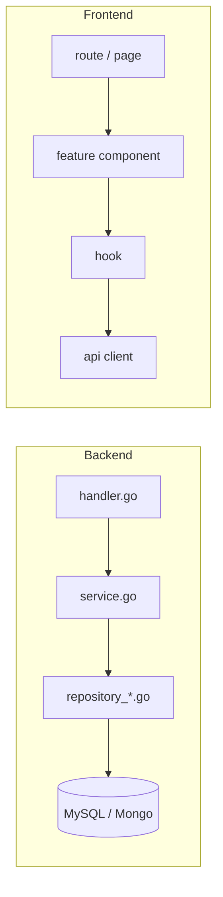

# Structure Standards

Governs monorepo layout, dependency direction, and file contents inside a Go domain package and a
frontend feature folder. Read by all Jarvis agents, reviewers (`STD`), and the `lint` script.
Does not cover naming conventions, coding style, or test content — see `coding-go.md`,
`coding-react.md`, `testing.md`.

## Layout

```
apps/
  web/src/
    app/                    # routing, providers, layouts
    features/<feature>/     # components, hooks, api, schemas, __tests__
    shared/                 # ui wrappers, hooks, utils
    lib/                    # api client, error-message map, logger
  api/
    cmd/<service>/main.go
    internal/
      <domain>/             # handler.go, service.go, repository_mysql.go,
                            # repository_mongo.go, model.go, dto.go,
                            # validation.go, cache.go, *_test.go
      platform/             # config, db, cache, logger, apperror, middleware
    api/openapi.yaml
    migrations/mysql/  migrations/mongo/
packages/
  errors/                   # registry.yaml + generated Go/TS
  ui/                       # shared components
  api-client/               # generated from openapi.yaml
  config/                   # shared eslint/tsconfig
docs/ work/ adr/ architecture/
```

## Dependency Direction



Arrows never reverse: a repository never calls its service, a service never calls its handler, a hook
never imports a route, an api client never imports a hook. Each layer only knows about the layer
directly below it.

### STR-01 — Dependency direction handler → service → repository (MUST)
In a Go domain package, `handler.go` may call only `service.go`, and `service.go` may call only
`repository_*.go`; no layer calls upward or skips a layer.

✅
```go
// handler.go
func (h *Handler) GetUser(w http.ResponseWriter, r *http.Request) {
    u, err := h.service.GetUser(r.Context(), id)
    respond(w, u, err)
}
```
❌
```go
// handler.go
func (h *Handler) GetUser(w http.ResponseWriter, r *http.Request) {
    u, err := h.repo.FindByID(r.Context(), id) // skips service.go
    respond(w, u, err)
}
```

### STR-02 — DB access only in repository (MUST)
Only `repository_mysql.go` and `repository_mongo.go` may import a database driver or ORM; no other
file in the domain package may open a connection, build a query, or import `database/sql`,
`mongo-driver`, or an ORM package.

✅
```go
// repository_mysql.go
func (r *UserRepo) FindByID(ctx context.Context, id string) (*User, error) {
    return r.queryUser(ctx, id)
}
```
❌
```go
// service.go
func (s *UserService) GetUser(ctx context.Context, id string) (*User, error) {
    row := s.db.QueryRowContext(ctx, "SELECT * FROM users WHERE id=?", id) // DB call outside repository
    return scanUser(row)
}
```

### STR-03 — No business logic in handlers (MUST)
`handler.go` contains only request decoding, calling one service method, and response encoding; it
must not contain validation logic, branching on business state, or calls to more than one service
method to produce a result.

✅
```go
// handler.go
func (h *Handler) CreateOrder(w http.ResponseWriter, r *http.Request) {
    var dto CreateOrderRequest
    decode(r, &dto)
    order, err := h.service.CreateOrder(r.Context(), dto)
    respond(w, order, err)
}
```
❌
```go
// handler.go
func (h *Handler) CreateOrder(w http.ResponseWriter, r *http.Request) {
    var dto CreateOrderRequest
    decode(r, &dto)
    if dto.Total > 10000 && dto.Customer.Tier != "gold" { // business rule in handler
        respondError(w, ErrDiscountNotAllowed)
        return
    }
    respond(w, h.service.CreateOrder(r.Context(), dto))
}
```

### STR-04 — Interfaces defined by the consumer (MUST)
An interface for a dependency (e.g. a repository) is declared in the package that consumes it, not
in the package that implements it; the implementing file satisfies the interface implicitly.

✅
```go
// service.go — consumer defines the interface it needs
type userRepository interface {
    FindByID(ctx context.Context, id string) (*User, error)
}
```
❌
```go
// repository_mysql.go — implementer defines and exports the interface
type UserRepository interface {
    FindByID(ctx context.Context, id string) (*User, error)
}
type UserRepo struct{ db *sql.DB }
```

### STR-05 — A domain never imports another domain's repository (MUST)
Cross-domain access goes through the other domain's `service.go`; a domain package must not import
`internal/<other-domain>/repository_*.go` or `internal/<other-domain>/model.go` directly for data
access.

✅
```go
// internal/order/service.go
func (s *OrderService) attachCustomer(ctx context.Context, id string) (*user.User, error) {
    return s.userService.GetUser(ctx, id) // via user's service
}
```
❌
```go
// internal/order/service.go
func (s *OrderService) attachCustomer(ctx context.Context, id string) (*user.User, error) {
    return s.userRepo.FindByID(ctx, id) // reaches into user's repository directly
}
```

### STR-06 — No circular imports (MUST)
No two packages under `internal/` or `apps/web/src/features/` may import each other, directly or
transitively; dependency graph among domains and features must be acyclic.

✅
```go
// internal/order imports internal/user; internal/user imports nothing from internal/order
import "myapp/internal/user"
```
❌
```go
// internal/order imports internal/user, and internal/user imports internal/order
import "myapp/internal/order" // in internal/user/service.go — creates a cycle
```

### STR-07 — platform/ has no domain imports (MUST) [ADDED]
Files under `internal/platform/` (config, db, cache, logger, apperror, middleware) must not import
any package under `internal/<domain>/`; platform is a leaf dependency for all domains.

✅
```go
// internal/platform/db/mysql.go
package db
func Connect(dsn string) (*sql.DB, error) { return sql.Open("mysql", dsn) }
```
❌
```go
// internal/platform/middleware/auth.go
import "myapp/internal/user" // platform depending on a domain
```

### STR-08 — cmd/ only wires dependencies (MUST) [ADDED]
`cmd/<service>/main.go` contains only construction and wiring (config load, DB connect, repository/
service/handler instantiation, router registration, server start); it must not contain business
logic, request handling, or SQL/query strings.

✅
```go
// cmd/api/main.go
func main() {
    db := platform.MustConnect(config.Load().DSN)
    userSvc := user.NewService(user.NewMySQLRepository(db))
    userSvc.RegisterRoutes(router)
}
```
❌
```go
// cmd/api/main.go
router.HandleFunc("/users/:id", func(w http.ResponseWriter, r *http.Request) {
    row := db.QueryRow("SELECT * FROM users WHERE id=?", r.PathValue("id")) // logic in main
})
```

### STR-09 — shared/ has no feature imports (MUST) [ADDED]
Files under `apps/web/src/shared/` must not import from `apps/web/src/features/<feature>/`; shared
code is a leaf dependency for every feature.

✅
```tsx
// shared/ui/Button.tsx
export function Button(props: ButtonProps) { return <button {...props} />; }
```
❌
```tsx
// shared/hooks/useFormatOrder.ts
import { OrderStatus } from "../../features/orders/schemas"; // shared depending on a feature
```

## Go Domain Package Contents

| file | contains | must not contain |
|---|---|---|
| `handler.go` | HTTP decode/encode, one service call per action | validation logic, business rules, DB/cache calls |
| `service.go` | business logic, orchestration across repositories, error wrapping | HTTP types (`http.Request`/`ResponseWriter`), SQL/query strings |
| `repository_mysql.go` | MySQL queries, row scanning, `database/sql` calls | business logic, HTTP types, validation |
| `repository_mongo.go` | Mongo queries/aggregations, document mapping | business logic, HTTP types, validation |
| `model.go` | domain structs, domain methods with no I/O | DB tags coupling to a single store, HTTP/JSON tags |
| `dto.go` | request/response structs, JSON tags | business logic, DB calls |
| `validation.go` | input validation functions | DB calls, HTTP handling |
| `cache.go` | cache key building, get/set wrappers over `platform/cache` | business logic, direct DB queries |
| `*_test.go` | table-driven tests for the sibling file | production logic reused nowhere else |

## Frontend Feature Folder

Inside `apps/web/src/features/<feature>/`:

| path | contains |
|---|---|
| `components/` | presentational and container components scoped to this feature |
| `hooks/` | feature-specific hooks (data fetching orchestration, local state) |
| `api/` | api client calls for this feature, built on `apps/web/src/lib` client |
| `schemas/` | validation/type schemas (e.g. zod) for this feature's data |
| `__tests__/` | tests for this feature's components, hooks, and api modules |

## Exceptions
Any deviation from a rule in this file requires an ADR in `docs/adr/` that references the rule ID (e.g. `[STR-04]`) and is approved before the code merges.
