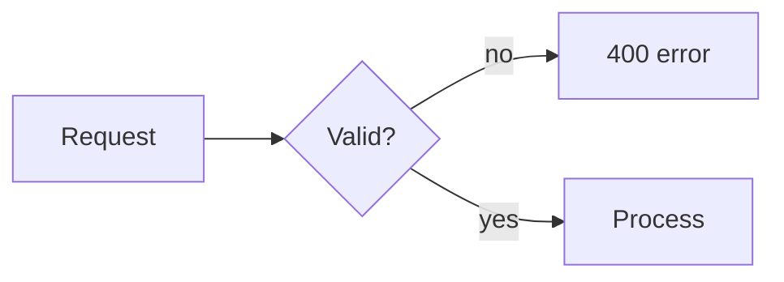
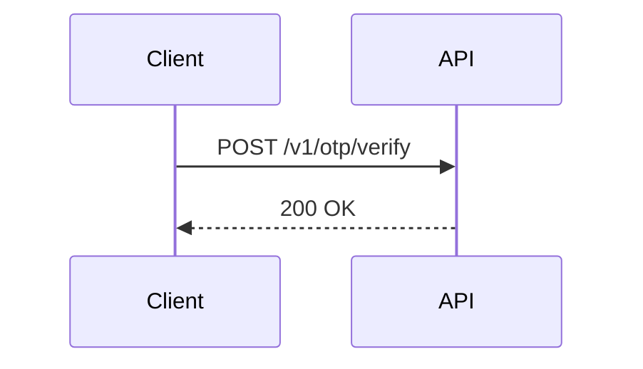

# Documentation Standards

Purpose: keep every artifact short, traceable, and reviewable by both agents and humans.
Scope: all artifacts under `docs/work/<ID>-<slug>/`, `docs/adr/`, `docs/architecture/`, and their templates.
Out of scope: code comments (`coding-go.md`, `coding-react.md`), commit/PR text (`git.md`).

### DOC-01 — English only (MUST)
Every framework file and every generated artifact is written in English; no mixed-language sections.

✅
```
## Root Cause
The cache key omits the tenant ID, so tenant B reads tenant A's cached quote.
```
❌
```
## Root Cause
สาเหตุคือ cache key ไม่มี tenant ID ทำให้เกิด cross-tenant read
```

### DOC-02 — Tables over prose (MUST)
Structured facts (requirements, rules, findings, options) are written as tables or bullets, one fact
per row; a paragraph is used only for narrative context that a table cannot capture.

✅
```
| ID | Description | Priority |
|---|---|---|
| FR-003 | User can cancel a pending order | Must |
```
❌
```
The user should also be able to cancel an order, which is important, as well as viewing its status,
and this is a Must-have requirement that we need to build first before anything else...
```

### DOC-03 — Mermaid for every diagram (MUST)
Every diagram in an artifact is Mermaid source; ASCII-art diagrams and screenshots used as the only
source of a design are not allowed — a screenshot may only illustrate, never replace, the Mermaid.

✅
````

````
❌
```
+--------+     +---------+
| Client | --> | Service |   <- ASCII box diagram
+--------+     +---------+
```

### DOC-04 — Every requirement, rule, and finding carries an ID (MUST)
Every FR, NFR, US, AC, BR, UX unit, task, TC, review finding, defect, risk, and open question has an
ID in the format defined by `.jarvis/core/rules/conventions.md` §1; nothing referenced later is unlabeled.

✅ `AC-004-02: Given an amount <= 0, the API returns 400 with code bmsg_validation_error.`
❌ `The API should also reject zero or negative amounts.` (no AC id, not traceable)

### DOC-05 — Templates define required sections and length; do not restate them (MUST)
An artifact follows the section list and length implied by its template in `.jarvis/core/templates/`;
the artifact itself never repeats the template's instruction comments or restates what a section is for.

✅
```
## Root Cause
<!-- the actual finding, not the instruction -->
Session token TTL was read from the wrong config key (`platform/config.go:41`).
```
❌
```
## Root Cause
<!-- Describe the root cause of the incident here, citing evidence -->
```

### DOC-06 — No `TBD`/`TODO`/`???` in a `final` artifact (MUST)
An artifact with `status: final` in its front matter contains no `TBD`, `TODO`, `???`, or
"N/A (to be decided)"; an unresolved point is raised as `Q-<NNN>` in the artifact's Open Questions.

✅ `Q-004: retention period for OTP audit logs is undecided — confirm with compliance by 2026-09-25.`
❌ `Retention period: TBD` (left inside a `status: final` artifact)

### DOC-07 — Every claim about the codebase cites `file.go:line` (MUST)
A statement about existing code, behavior, or a bug cites the exact file and line it is based on;
a claim with no citation is treated as unverified and fails review.

✅ `The handler skips validation before calling the service (internal/order/handler.go:52).`
❌ `The handler doesn't validate input properly somewhere in the order package.`

### DOC-08 — Front matter is present and valid on every artifact (MUST)
Every artifact in `docs/work/<ID>-<slug>/` and every ADR starts with the exact front matter block
defined in `.jarvis/core/rules/conventions.md` §2 (`id`, `artifact`, `version`, `status`, `refs`); this
file does not restate that block — see conventions.md §2 for the fields.

✅
```yaml
---
id: FEAT-012
artifact: tech-spec
version: 2
status: draft
refs: [prd.md, brief.md]
---
```
❌
```yaml
---
title: Tech Spec for OTP
---
```

### DOC-09 — Diagrams must be valid Mermaid that renders (MUST)
Every Mermaid block parses without error in the standard Mermaid renderer used by `validate.js`; a
diagram that fails to render fails the gate the same as a missing diagram.

✅

❌
```mermaid
sequenceDiagram
  Client->>API POST /v1/otp/verify   // missing colon, invalid syntax, fails to parse
```

### DOC-10 — Keep an artifact under the length its template implies (MUST)
An artifact stays within the length implied by its template's section count and purpose (a `brief.md`
is not a `tech-spec.md`); a section that grows past what a reviewer can check in one pass is split or
summarized with a link instead of inlined in full.

✅ `tech-spec.md` covers its 15 required sections concisely, with large payloads linked, not pasted.
❌ `brief.md` (five short sections expected) grows to 40 pages with full API payloads pasted inline.

### DOC-11 — ADRs are immutable once accepted (MUST)
An accepted ADR is never edited in place; a later change is a new ADR that supersedes it and links
back to the superseded ADR's ID.

✅ `ADR-0012` (status: superseded, "superseded by ADR-0019") stays as written; `ADR-0019` is new.
❌ Editing `ADR-0007`'s Decision section in place after it was accepted and merged.

### DOC-12 — Links use repo-relative paths (MUST)
A link or cross-reference to another file in the repo uses a path relative to the repo root; no
absolute local filesystem paths, no links into a personal machine, no bare filenames without a path.

✅ `See [tech-spec.md](../FEAT-012-otp/tech-spec.md) for the API contract.`
❌ `See /Users/alice/project/docs/work/FEAT-012-otp/tech-spec.md for the API contract.`

## Artifact Locations

| artifact | path | written by |
|---|---|---|
| work folder | `docs/work/<ID>-<slug>/` | the agent for each phase (see phase catalogue), one artifact per phase |
| ADR | `docs/adr/ADR-<NNNN>-<slug>.md` | {{name}}-architect (created), any agent proposing a standards exception |
| Query-Index Matrix | `docs/architecture/query-index-matrix.md` | {{name}}-architect (created during architecture), {{name}}-dev-backend (updated during implement) |

## Mermaid Types

| purpose | diagram type |
|---|---|
| flow | `flowchart` |
| interaction | `sequenceDiagram` |
| lifecycle | `stateDiagram-v2` |
| structure | `graph` / `C4Context` |
| schedule | `gantt` |

## Exceptions
Any deviation from a rule in this file requires an ADR in `docs/adr/` that references the rule ID (e.g. `[DOC-06]`) and is approved before the code merges.
