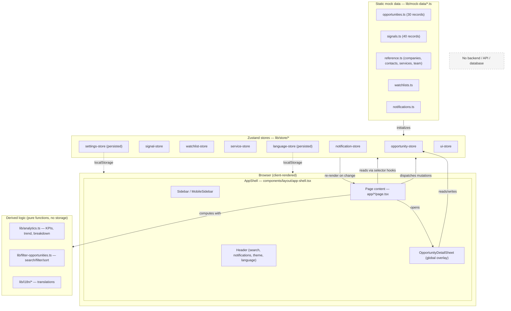

# System Design & UI/UX Design System

**Project:** Customer Opportunity Discovery — a social-listening / sales-intent B2B SaaS prototype
**Scope of this document:** Reverse-engineered strictly from the source code in this repository as of the current commit. No behavior or value in this document was invented — anything that could not be confirmed in code is explicitly marked **Not found / Not confirmed**.
**Repository root:** `/Users/chanasakchoonuch/Documents/tokyo/project/social listening`

---

## 1. Application Design Overview

### What the app is

A frontend-only (no backend, no database — confirmed by the absence of any API routes, server actions, ORM, or network client in the repo) Next.js SaaS dashboard. It simulates a product that turns public social-media posts into scored sales opportunities. All data is static TypeScript mock data (`lib/mock-data/*`) held in client-side Zustand stores (`lib/store/*`).

### Overall design style

- **Neutral-first, single-accent SaaS UI.** The base palette (background, card, border, muted text) is an almost-grayscale OKLCH neutral ramp (shadcn's "Nova" preset, `baseColor: "neutral"` — confirmed in `components.json`). Color is then reserved for exactly three jobs: one **brand blue** accent (`--brand`, `#2a78d6` light / `#3987e5` dark) used for primary actions, links, active nav, and focus rings; a small **status/intent color set** (red/amber/teal/violet/orange/green) used only for badges that carry meaning (intent level, pipeline status); and an 8-hue **categorical chart palette** used only inside data visualizations.
- **Flat elevation, not shadow-heavy.** Cards and dialogs are separated from the background with a 1px `ring-foreground/10` (see `components/ui/card.tsx`, `components/ui/dialog.tsx`) rather than drop shadows. Only floating/overlay surfaces that sit above other content (dropdown menus, select menus, popovers, sheets, the command palette) use `shadow-md`/`shadow-lg` (confirmed via grep across `components/ui/*.tsx`).
- **Information-dense but airy.** Consistent `text-sm` body copy, `text-xs` for metadata/labels, generous 12–24px spacing between blocks, and a lot of `text-muted-foreground` for secondary information — the pattern used by Linear/Attio/Vercel-style dashboards.
- **Icon-first, restrained iconography.** Every icon is from a single library (`lucide-react`) at one of two sizes almost everywhere (`size-4` / `size-3.5`), and status/intent are never color-only — every colored badge pairs an icon + text + color (see `components/shared/badges.tsx`).

### Visual identity

- Typeface: Inter for Latin script, Noto Sans Thai for Thai, Noto Sans SC for Simplified Chinese — loaded together as one `--font-sans` stack (`app/layout.tsx`) so the correct script always renders in its purpose-built font without any manual language-switching CSS.
- One brand color (blue) rather than a multi-color "AI product" gradient palette. No gradients are used anywhere in the UI chrome (the only gradient in the codebase is a single `<linearGradient>` fill under the area chart line — see §14).
- Rounded-but-restrained geometry: base corner radius 10px (`--radius: 0.625rem`), scaling down to 6px for compact controls and up to 14px for cards — never pill-shaped except badges and the sidebar's segmented controls.

### Design philosophy

1. **Trust the neutral system, spend color deliberately.** Nearly every surface is a shade of gray/white/near-black; color exists only where it communicates status, intent, or brand action.
2. **State is always visible, never color-only.** Status and intent are icon + label + color triads (accessibility requirement baked into `IntentBadge`/`StatusBadge`).
3. **One shared design-token layer drives every surface.** All components consume the same CSS custom properties (`--background`, `--card`, `--brand`, `--intent-high`, etc.) defined once in `app/globals.css`, so light/dark mode and brand color changes propagate everywhere automatically.
4. **Mobile is a first-class layout, not a shrink.** Tables become cards, filter bars become bottom sheets, multi-column grids become 1–2 columns — implemented per-page, not via a single generic "responsive wrapper."

### Target user experience

A B2B sales/BD user scanning a list of leads and opportunities: fast scanning (compact table rows, badges, truncated text with tooltips-on-hover-via-title where relevant), quick triage actions (save, assign, change status) available inline without full page navigation, and a slide-over detail panel (`OpportunityDetailSheet`) that never requires leaving the current page context.

### Overall visual hierarchy

1. Page title (`text-xl font-semibold`) + one-line subtitle (`text-sm text-muted-foreground`) — `components/shared/page-header.tsx`.
2. KPI/stat row (large `text-2xl` numbers, small labels).
3. Primary content (table, card grid, or chart) in `Card` surfaces with a 1px ring border.
4. Secondary/tertiary metadata (timestamps, counts, muted badges) always smaller and lower-contrast than primary content.

### Design Principles

_(to preserve when reusing this design language elsewhere)_

1. Neutral base + exactly one brand accent color. Do not introduce a second "loud" brand color.
2. Status/intent color always ships with an icon and a text label — never a bare color dot or bare colored background.
3. Elevation is a 1px ring on resting surfaces (cards), and shadow only on surfaces that float above content (menus, sheets, dialogs).
4. One icon library, two icon sizes for 90% of usage (16px / 14px).
5. Radius scales from a single `--radius` token — never hand-pick arbitrary corner radii per component.
6. Every list/detail page follows the same skeleton → content → empty-state state machine (see §12).
7. Every mobile filter/action surface must keep its confirm/cancel actions reachable within a bounded, internally-scrolling container — never let content push controls off-screen (a real bug found and fixed during development, see `components/ui/dialog.tsx` and the two mobile filter sheets).

---

## 2. Design Tokens

All tokens are defined once in `app/globals.css`, inside `:root` (light) and `.dark` (dark), and re-exposed to Tailwind utilities via the `@theme inline` block at the top of the same file (e.g. `--color-brand: var(--brand)` makes `bg-brand`/`text-brand` available, though in practice the app mostly consumes these as raw CSS vars via inline `style={{ color: "var(--brand)" }}` rather than Tailwind color utility classes — both patterns are used, see `components/shared/badges.tsx` for the `style=` pattern and `components/layout/sidebar-content.tsx` for `style={{ color: "var(--brand)" }}` on the active nav link).

### Colors

The base neutral scale (background/foreground/card/popover/secondary/muted/accent/border/input/ring) comes from shadcn's **Nova** preset with `baseColor: neutral`, expressed in **OKLCH**. The brand, intent, status, semantic and chart colors were hand-authored on top of that preset and are plain **hex**.

| Token | Light value | Dark value | Used for | Example usage |
|---|---|---|---|---|
| `--background` | `oklch(1 0 0)` (white) | `oklch(0.145 0 0)` (near-black) | Page background | `body { @apply bg-background }` |
| `--foreground` | `oklch(0.145 0 0)` | `oklch(0.985 0 0)` | Default text | global default text color |
| `--card` | `oklch(1 0 0)` | `oklch(0.205 0 0)` | Card/surface background | `components/ui/card.tsx` |
| `--card-foreground` | `oklch(0.145 0 0)` | `oklch(0.985 0 0)` | Text on cards | — |
| `--popover` / `--popover-foreground` | same as card | same as card | Dropdown/select/tooltip-adjacent surfaces | `components/ui/dropdown-menu.tsx`, `select.tsx` |
| `--primary` | `var(--brand)` → `#2a78d6` | `var(--brand)` → `#3987e5` | Primary buttons, active states | `Button` `variant="default"` |
| `--primary-foreground` | `var(--brand-foreground)` → `#ffffff` | `#06131f` | Text on primary buttons | — |
| `--secondary` | `oklch(0.97 0 0)` (very light gray) | `oklch(0.269 0 0)` (dark gray) | Secondary buttons, chip backgrounds | `Button` `variant="secondary"` |
| `--muted` | `oklch(0.97 0 0)` | `oklch(0.269 0 0)` | Muted surfaces (search bar fill, badge backgrounds) | header search input `bg-muted/40` |
| `--muted-foreground` | `oklch(0.556 0 0)` | `oklch(0.708 0 0)` | Secondary/caption text | subtitles, timestamps |
| `--accent` | `oklch(0.97 0 0)` | `oklch(0.269 0 0)` | Hover backgrounds | `hover:bg-accent` on nav items, menu items |
| `--accent-foreground` | `oklch(0.205 0 0)` | `oklch(0.985 0 0)` | Text on accent/hover backgrounds | — |
| `--destructive` | `oklch(0.577 0.245 27.325)` (red) | `oklch(0.704 0.191 22.216)` | Destructive button/text (delete) | `Button` `variant="destructive"`, `DropdownMenuItem variant="destructive"` |
| `--border` | `oklch(0.922 0 0)` | `oklch(1 0 0 / 10%)` (10% white) | All hairline borders | cards, inputs, table rows |
| `--input` | `oklch(0.922 0 0)` | `oklch(1 0 0 / 15%)` | Input border/fill base | `Input`, `Select` |
| `--ring` | `var(--brand)` | `var(--brand)` | Focus ring color | `focus-visible:ring-ring/50` |
| `--brand` | `#2a78d6` | `#3987e5` | Primary brand/accent blue | active nav text color, `Toggle`/checked states, chart series 1 |
| `--brand-foreground` | `#ffffff` | `#06131f` | Text/icon on brand-colored fills | — |

**Intent colors** (`components/shared/badges.tsx`, used by `IntentBadge`):

| Token | Light | Dark | Meaning |
|---|---|---|---|
| `--intent-high` | `#e34948` (red) | `#e66767` | High buying intent — icon `SignalHigh` |
| `--intent-medium` | `#b8790a` (amber) | `#e0a539` | Medium intent — icon `SignalMedium` |
| `--intent-low` | `#12855f` (teal) | `#2fbf8e` | Low intent — icon `SignalLow` |

**Status-pipeline colors** (7 stages, `components/shared/badges.tsx`, used by `StatusBadge`):

| Status | Light | Dark | Icon |
|---|---|---|---|
| `new` | `#2a78d6` | `#3987e5` | `Sparkles` |
| `saved` | `#4a3aa7` (violet) | `#9085e9` | `Bookmark` |
| `contacted` | `#b8790a` (amber) | `#e0a539` | `PhoneCall` |
| `qualified` | `#12855f` (teal) | `#2fbf8e` | `BadgeCheck` |
| `meeting` | `#eb6834` (orange) | `#d95926` | `CalendarClock` |
| `won` | `#067a06` (green) | `#3fc23f` | `Trophy` |
| `lost` | `#b23434` (red) | `#e66767` | `XCircle` |

**Semantic/status-scale colors** (fixed, not themed — same value in both modes): `--success: #0ca30c`, `--warning: #fab219`, `--serious: #ec835a`, `--critical: #d03b3b`. Used in `components/shared/error-state.tsx` (`--critical`), `components/dashboard/kpi-card.tsx` (`--success` for positive deltas, `--critical` for negative), and the Analytics "success text" delta color.

**Categorical chart palette** (8 hues, `--chart-1` … `--chart-8`, defined in both `:root` and `.dark` with distinct dark-optimized steps):

| Slot | Hue | Light | Dark |
|---|---|---|---|
| chart-1 | blue | `#2a78d6` | `#3987e5` |
| chart-2 | orange | `#eb6834` | `#d95926` |
| chart-3 | aqua/teal | `#1baf7a` | `#199e70` |
| chart-4 | yellow/amber | `#eda100` | `#c98500` |
| chart-5 | magenta | `#e87ba4` | `#d55181` |
| chart-6 | green | `#008300` | `#1f9e1f` |
| chart-7 | violet | `#4a3aa7` | `#9085e9` |
| chart-8 | red | `#e34948` | `#e66767` |

Used in: `OpportunityTrendChart`/`VolumeChart` (chart-1 as the single series), `IntentBreakdownChart` (maps intent tokens, not chart tokens), `components/analytics/horizontal-bar-list.tsx` (chart-1/2/3 passed per chart), `components/services/service-card.tsx` (a service's `color` field cycles through `chart-1`…`chart-8`, assigned in `lib/store/service-store.ts`), `components/shared/initials-avatar.tsx` (deterministic per-name color from this same 8-slot set via a string hash).

**Hover / active / disabled states** — not separate tokens; derived per-component via Tailwind opacity/shade modifiers on the base tokens above, e.g.:
- Hover: `hover:bg-primary/80` (default button), `hover:bg-muted` (ghost button/nav item), `hover:bg-accent` (menu items).
- Active/pressed: `active:translate-y-px` (button press micro-motion, see §14) plus the `bg-accent` "current page" state.
- Disabled: `disabled:opacity-50 disabled:pointer-events-none` (uniform across `Button`, `Input`, `Select`).
- Focus: `focus-visible:ring-3 focus-visible:ring-ring/50` + `focus-visible:border-ring` — a 3px, 50%-opacity brand-colored ring, consistent across `Button`, `Input`, `Select`, `Textarea`.

**Gradients**: **Not found** as a design-system token. The only gradient in the codebase is a single inline SVG `<linearGradient>` used once, as a fade-to-transparent fill under the area-chart line (`components/dashboard/opportunity-trend-chart.tsx`, id `trendFill`, `var(--color-count)` at 22%→0% opacity). No gradients are used on buttons, cards, backgrounds, or text.

### Typography

**Font family** (`app/layout.tsx`, via `next/font/google`):
- **Inter** — Latin script, subset `latin`, variable `--font-inter`.
- **Noto Sans Thai** — Thai script, subset `thai`, weights `400/500/600/700`, variable `--font-noto-thai`.
- **Noto Sans SC** — Simplified Chinese, weights `400/500/600/700`, `preload: false`, variable `--font-noto-sc`.

Combined into one CSS stack in `app/globals.css`:
```
--font-sans: var(--font-inter), var(--font-noto-thai), var(--font-noto-sc), ui-sans-serif, system-ui, sans-serif;
```
There is no separate serif or monospace font used in the UI (a `--font-mono: var(--font-geist-mono)` token exists in the `@theme inline` block but no Geist Mono font is actually loaded/imported anywhere — **Not confirmed as in use**; likely an unused leftover from the shadcn scaffold).

Font weights actually used in components (grep-confirmed): `font-medium` (most labels/buttons/badges), `font-semibold` (page titles, card titles), `font-bold` — **not found** in app code (only `font-semibold` used for the strongest weight). No `font-light` usage found.

Typography scale (values found directly in component source, not invented):

| Element | Font | Weight | Size (Tailwind → px) | Line Height | Usage |
|---|---|---:|---:|---:|---|
| Page title (h1) | sans | `font-semibold` | `text-xl` → 20px | `tracking-tight` (default LH) | `PageHeader` title — `components/shared/page-header.tsx` |
| Page subtitle | sans | regular | `text-sm` → 14px | default | `PageHeader` subtitle, muted color |
| Section heading | sans | `font-semibold` | `text-base` → 16px | default | e.g. "Top Opportunities" on Overview |
| Card title | sans | `font-medium` | `text-base` → 16px, `leading-snug` | snug | `CardTitle` — `components/ui/card.tsx` |
| Hero search title | sans | `font-semibold` | `text-2xl` → 24px | `tracking-tight` | Search page heading |
| Body / default | sans | regular | `text-sm` → 14px | default | most paragraph and list text |
| Small/meta text | sans | regular | `text-xs` → 12px | default | timestamps, badge labels, table meta |
| Micro label | sans | `font-medium` | `text-[10px]`/`text-[11px]` (arbitrary) | default | kbd shortcut hint, nav section labels (`uppercase tracking-wide`) |
| Button text | sans | `font-medium` | `text-sm` (default size) / `text-[0.8rem]` (`sm`) / `text-xs` (`xs`) | default | `components/ui/button.tsx` |
| Nav link | sans | `font-medium` | `text-sm` | default | `components/layout/sidebar-content.tsx` |
| KPI number | sans | `font-semibold` | `text-2xl`, `tabular-nums tracking-tight` | default | `components/dashboard/kpi-card.tsx` |

Letter spacing: `tracking-tight` on page titles and KPI numbers; `tracking-wide` (uppercase) on sidebar section labels ("WORKSPACE", "DISCOVERY", "MANAGEMENT"). No other letter-spacing utilities found in use.

Numeric alignment: `tabular-nums` is applied wherever numbers must align in a column or read as a stable metric (KPI values, table numeric cells, avatar initials) — confirmed in `kpi-card.tsx`, `initials-avatar.tsx`, table cells in `opportunity-table.tsx`.

### Spacing

No custom spacing scale is defined — the app uses Tailwind's default spacing scale (`0.25rem` = 4px increments) throughout. There is no `tailwind.config.js`/`.ts` in the repo (Tailwind v4 CSS-first config only, via `app/globals.css` + `postcss.config.mjs`), so no spacing token overrides exist — **default Tailwind spacing scale confirmed as unmodified**.

Recurring, code-confirmed spacing values:

| Context | Value | Source |
|---|---|---|
| Card internal padding | `1rem` (16px), exposed as the `--card-spacing` CSS var on `Card`; `0.75rem` (12px) when `size="sm"` | `components/ui/card.tsx` |
| Page horizontal padding | `1rem` (16px) mobile → `1.5rem` (24px) at `sm:` | `PageHeader`/`PageContainer` — `px-4 … sm:px-6` |
| Page vertical padding (header) | `1rem` mobile → `1.25rem` at `sm:` (`py-4 … sm:py-5`) | `PageHeader` |
| Page vertical padding (content) | `1.25rem` mobile → `1.5rem` at `sm:` (`py-5 … sm:py-6`) | `PageContainer` |
| Grid/card gaps | `0.75rem`–`1rem` (`gap-3`/`gap-4`) between KPI cards, opportunity cards, chart cards | Overview, Opportunities, Analytics pages |
| Form field spacing | `space-y-1.5` between a `Label` and its control; `space-y-4`/`gap-4` between fields in a form | `WatchlistFormDialog`, `ServiceFormDialog`, Settings sections |
| Section spacing on a page | `mt-4` between major stacked blocks (KPI row → charts → list) | `app/page.tsx`, `app/analytics/page.tsx` |
| Sidebar item padding | `px-2 py-1.5` | `components/layout/sidebar-content.tsx` |
| Header height / padding | height `h-14` (56px), horizontal `px-3` mobile → `px-4` at `sm:` | `components/layout/header.tsx` |

Mobile spacing adjustments follow a consistent pattern: **the same padding scale, one step down**, e.g. `px-4 sm:px-6`, `py-4 sm:py-5`, rather than a wholesale different mobile spacing system.

A `data-density="compact"` mode exists (`app/globals.css`) that overrides table cell vertical padding to `0.375rem` via `!important`, toggled globally from Settings → Appearance → Density (`lib/store/settings-store.ts`, applied as a `data-density` attribute on the app root in `components/layout/app-shell.tsx`). This is the only place a user-facing "density" setting actually changes rendered spacing — it is scoped to `<table>` cells only (**confirmed**; does not affect card or form padding).

### Border Radius

Single source token: `--radius: 0.625rem` (10px), with derived scale in `app/globals.css`:

| Token | Formula | Value | Used by |
|---|---|---:|---|
| `--radius-sm` | `radius * 0.6` | 6px | `Select` `size="sm"`, `Button` `size="xs"` (via `min()` clamp) |
| `--radius-md` | `radius * 0.8` | 8px | `Button` `size="sm"`/`xs` (clamped), tooltips (`rounded-md`) |
| `--radius-lg` | `= radius` | 10px | **Default** for `Button`, `Input`, `Select trigger` (`rounded-lg`) |
| `--radius-xl` | `radius * 1.4` | 14px | `Card`, `Dialog`, `AlertDialog` (`rounded-xl`) |
| `--radius-2xl` | `radius * 1.8` | 18px | Not found in active component use |
| `--radius-3xl` | `radius * 2.2` | 22px | Not found in active component use |
| `--radius-4xl` | `radius * 2.6` | 26px | `Badge` (`rounded-4xl`) — effectively a full pill at badge height (20px) |

Fully pill-shaped (`rounded-full`): `InitialsAvatar`, notification unread dot, the sidebar/date-range segmented-control's active pill is `rounded-[5px]` (not a pill — small radius), status dots in analytics legends.

### Shadows

The app deliberately avoids drop shadows on resting surfaces:

| Surface | Elevation technique | Class |
|---|---|---|
| `Card` (default resting surface) | 1px inset ring, no shadow | `ring-1 ring-foreground/10` |
| `Dialog` / `AlertDialog` content | 1px ring, no shadow | `ring-1 ring-foreground/10` |
| `Sheet` (drawers) | drop shadow | `shadow-lg` |
| `DropdownMenu` content | drop shadow, two variants seen | `shadow-md` / `shadow-lg` |
| `Select` content, `Popover` content, `NavigationMenu` | drop shadow | `shadow-md` |
| `Command` (⌘K palette) | explicitly no shadow (relies on Dialog's own overlay) | `shadow-none` |
| `Tabs` (installed, unused in-app) | `shadow-sm` (active tab), `shadow-none` (inactive) | `components/ui/tabs.tsx` |
| Chart tooltip (`ChartTooltipContent`) | drop shadow | `shadow-xl` |

No custom shadow color/tint (e.g. colored shadows) was found — all shadows use Tailwind's default neutral shadow palette.

### Borders

- Width: `1px` everywhere (`border`, `border-b`, `border-t`) — no `border-2`/thicker borders found in app-authored code.
- Color: always the `--border` token (`border-border`), which resolves to a light gray hairline in light mode and a 10%-opacity white hairline in dark mode — **never a hardcoded gray hex** for borders.
- Style: solid only; one dashed exception — `EmptyState`'s outer container uses `border-dashed` to visually distinguish "nothing here yet" containers from normal cards (`components/shared/empty-state.tsx`).
- Common patterns: `border-b border-border` under page headers and table headers; `border-t border-border` above sticky action-bar footers (dialog/sheet footers, detail-sheet action bar).

---

## 3. Layout System

### Overall shape

Confirmed structure (`components/layout/app-shell.tsx`):

```
<div class="flex min-h-dvh" data-density="...">
  <Sidebar />        (desktop only, ≥ md)
  <MobileSidebar />  (Sheet drawer, < md)
  <div class="flex min-h-dvh flex-1 flex-col">
    <Header />       (sticky top-0, h-14)
    <main class="flex-1">{page content}</main>
  </div>
  <OpportunityDetailSheet />  (globally mounted, opens over any page)
</div>
```

- **No traditional `<footer>`.** No footer component or footer content exists anywhere in the app — **confirmed not present**.
- **Sidebar width:** `16rem`/256px expanded (`w-64`), `68px` collapsed (`w-[68px]`), animated via `transition-[width] duration-200` — `components/layout/sidebar.tsx`.
- **Header height:** fixed `h-14` (56px), `sticky top-0 z-30`, translucent with backdrop blur (`bg-background/95 backdrop-blur`).
- **Page container max-width:** `max-w-[1400px]`, horizontally centered (`mx-auto`) — `components/shared/page-header.tsx` (`PageContainer`). Below 1400px viewport width this has no visible effect (content is edge-to-edge within the padding); above it, content stops growing and centers.
- **Grid system:** CSS Grid via Tailwind utilities (`grid grid-cols-*`), not a custom 12-column grid framework. Column counts are chosen per content type (2/3/5 for KPI cards, 1/2/3 for card grids, 1/2/3 for chart layouts) rather than a single global grid.
- **Flex layouts:** used pervasively for one-dimensional arrangements (toolbars, header rows, badge rows) — `flex`, `flex-wrap`, `items-center`, `justify-between` are the dominant layout primitives outside of the grid-based content areas.

### Desktop vs. tablet vs. mobile layout changes

- **Desktop (≥ `md`, 768px+):** persistent icon+label sidebar (expandable/collapsible by the user), full multi-column grids, data tables shown as real `<table>` elements, inline filter bar.
- **Tablet:** same as desktop above `md` (768px) for the sidebar; grid column counts typically step down one level between `sm`/`md`/`lg`/`xl` (see §4 table).
- **Mobile (< `sm`, 640px):** sidebar becomes a slide-in `Sheet` drawer (`side="left"`, width `w-3/4` capped at `sm:max-w-sm`) triggered by a hamburger button in the header; the inline desktop filter row is replaced by a single "Filters" button that opens a bottom `Sheet`; data tables are replaced by a stacked single-column card list; multi-column KPI/chart grids collapse to 1–2 columns.

---

## 4. Responsive Design System

### Breakpoints

**Confirmed: Tailwind v4 default breakpoints, unmodified** (no `tailwind.config.*` file exists, and `app/globals.css` defines no `--breakpoint-*` overrides):

| Name | Min-width |
|---|---|
| `sm` | 640px |
| `md` | 768px |
| `lg` | 1024px |
| `xl` | 1280px |
| `2xl` | 1536px |

The app's own responsive logic is authored almost entirely around **`sm` (640px)** as the mobile/desktop split, and **`md`/`lg`** for sidebar and dense-grid transitions.

### Component-by-breakpoint behavior

| Component | Desktop (≥ lg) | Tablet (sm–lg) | Mobile (< sm) |
|---|---|---|---|
| Sidebar | Persistent, `w-64`, collapsible to `w-[68px]` via its own toggle button | Same as desktop (kicks in at `md`, 768px) | Hidden; replaced by a `Sheet` drawer opened from a header hamburger button (`components/layout/mobile-sidebar.tsx`) |
| Header | Full row: hamburger (hidden `md:hidden`), search bar, notification/theme/language icons | Same | Same row, but the search bar's placeholder text truncates and the `⌘K` kbd hint is hidden (`hidden … sm:inline-flex`) |
| Opportunities filters | Inline row of 8 `Select` filters, wraps via `flex-wrap` | Same | Hidden; replaced by a "Filters" button opening a bottom `Sheet` containing the same filters stacked vertically (`app/opportunities/page.tsx`) |
| Opportunities table/cards | Table view or Card grid (`grid-cols-2 lg:grid-cols-3`), user-togglable | Card grid (`sm:grid-cols-2`) | Always the stacked single-column `OpportunityCard` list (table view is `hidden sm:block`) |
| KPI card row (Overview) | `grid-cols-5` | `grid-cols-3` (`sm`) | `grid-cols-2`, with the 5th (last) card spanning both columns so it isn't left half-width alone |
| Opportunity Detail | Right-side `Sheet`, capped at `sm:max-w-xl` (576px) | Same | Full viewport width (`w-full`, an explicit `data-[side=right]:w-full` override) |
| Detail-sheet action bar (Save/Assign/Contacted) | Horizontal `flex flex-wrap`, buttons `flex-1` | Same | `grid grid-cols-1` — full-width stacked buttons |
| Dialogs (Watchlist/Service/Assign/Note forms) | Centered modal, capped `sm:max-w-sm/md/lg`, `max-h-[85vh]` internally scrollable | Same | `max-w-[calc(100%-2rem)]` (16px side margins), same `max-h-[85vh]` scroll cap |
| Watchlist dialog Location/Min-Intent fields | 2-column grid | 2-column grid (from `sm:` up) | Stacked 1 column |
| Settings label+control rows (Theme, Density, Sidebar, Language selects) | `flex-row justify-between` | Same | Stacked (`flex-col items-start`), control becomes full width |
| Analytics chart grids | `lg:grid-cols-3` / `lg:grid-cols-2` | Single column (grid only activates at `lg`) | Single column |
| Chart card headers (Trend chart + date-range control) | `sm:flex-row justify-between` | Same | Stacked (`flex-col`) |
| Mobile filter sheets (Opportunities, Signals) | N/A (desktop uses inline filters) | N/A | Bottom `Sheet`, `max-h-[85vh]`, internally-scrolling filter list with a `flex-1 min-h-0` wrapper so the Clear/Apply footer buttons always stay visible |
| Command palette (⌘K) | Centered dialog | Same | Same (not device-specific) |
| Notification panel | `DropdownMenu`, `w-80` | Same | Same (dropdown, not a separate mobile sheet) |

### Other confirmed responsive rules

- **Tables never cause page-level horizontal scroll.** `OpportunityTable`'s `<table>` is wrapped in its own `overflow-x-auto rounded-lg border` container (`components/opportunities/opportunity-table.tsx`) — the table itself may scroll horizontally within that box on narrow/tablet widths, but the page body does not.
- **Typography does not have a distinct mobile scale.** No `text-xl sm:text-2xl`-style responsive font-size steps were found; the same type scale is used at every width. Only layout (stacking/columns), not type size, changes responsively.
- **Images:** no ``-based content images exist in the app (avatars are CSS-rendered initials, not image files) — **not applicable / not confirmed** as a responsive concern.
- **Buttons:** no explicit mobile-only touch-target enlargement found; icon buttons use the shared `size="icon"` (32px) or `size="icon-sm"` (28px) regardless of viewport.

### Patterns worth reusing in future applications

1. **Table → single-column card list**, never a horizontally-scrolling table on mobile, with a `hidden sm:block` / `sm:hidden` pair of blocks per page rather than one component with internal `useMediaQuery` branching.
2. **Any bottom-sheet or dialog with a footer of action buttons** must wrap its scrollable body in `min-h-0 flex-1 overflow-y-auto` inside a `flex flex-col` container capped with `max-h-[…vh]` — otherwise the footer can be pushed off-screen on short viewports (a real bug found and fixed in this codebase).
3. **Variant-scoped Tailwind overrides must match variant form exactly** (e.g. `data-[side=right]:w-full`, not a bare `w-full`) when overriding a shadcn/Radix primitive's own `data-*`-conditional classes — otherwise the utility-merge library (`cn`) cannot detect the conflict and the base class can win by CSS source order regardless of the JSX class list. (This caused a real full-width-vs-75%-width sheet bug during development.)

---

## 5. Navigation & Information Architecture

### Header (`components/layout/header.tsx`)

- Sticky, `h-14`, translucent (`bg-background/95` + backdrop blur).
- Left: hamburger menu button (mobile-only, `md:hidden`), then a search "button" (not a real input — clicking it opens the ⌘K command palette) with a placeholder, a search icon, and a `⌘K`/`Ctrl K` keyboard-shortcut hint (hidden below `sm`).
- Right (`ml-auto`): `NotificationPanel`, `ThemeToggle`, `LanguageSwitcher`, each a small icon button (`size="icon"`, 32px).

### Sidebar (`components/layout/sidebar-content.tsx`, wrapped by `sidebar.tsx` for desktop / `mobile-sidebar.tsx` for the mobile `Sheet`)

Three labeled sections (uppercase, `text-[11px] tracking-wide text-muted-foreground`, hidden when collapsed), defined in `components/layout/nav-items.ts`:

| Section | Items |
|---|---|
| Workspace | Overview, Opportunities, Saved Leads, Signals, Analytics |
| Discovery | Search, Watchlists |
| Management | Services, Team, Settings |

- **Active state:** background `bg-accent` + text color forced to `var(--brand)` via inline `style` (so it works regardless of Tailwind's color-utility purge). Determined by exact match for `/` and `startsWith(href + "/")` for all other routes.
- **Hover state:** `text-muted-foreground` → `hover:bg-accent hover:text-foreground`.
- **Collapsed state:** icons only, each wrapped in a `Tooltip` (`side="right"`) showing the label.
- **Footer:** a "Help" icon button (opens a toast, not a real help center — confirmed stubbed), a collapse/expand toggle (desktop only), and the `UserMenu` (avatar + name + workspace, opens a `DropdownMenu`).
- **Top:** `WorkspaceSwitcher` — an avatar + company name button opening a `DropdownMenu` (single workspace only; "create workspace" is a stubbed toast — **confirmed, not a real multi-tenant feature**).

### Command palette (`components/layout/command-palette.tsx`)

Built on `cmdk` via shadcn's `Command`/`CommandDialog`. Opened by clicking the header search button or `⌘/Ctrl+K`. Searches opportunities, companies, contacts, services (grouped `CommandGroup`s), plus a static "Pages" group of every nav destination — all client-side substring matching against the in-memory mock data (`shouldFilter={false}`, filtering is done manually in `command-palette.tsx` rather than via cmdk's built-in fuzzy filter).

### Dropdown menus

Consistent shadcn `DropdownMenu` used for: user menu, workspace switcher, theme toggle (Light/Dark/System), language switcher (EN/TH/中文), table row "more actions" menu, notification panel, watchlist/service card "edit/delete" menu. All follow the same visual pattern: trigger icon/avatar button → `shadow-md`/`shadow-lg` popover panel, items with `hover:bg-accent`, destructive items in `text-destructive`.

### Breadcrumbs

**Not found.** No breadcrumb component or usage exists in the app.

### Tabs

The shadcn `Tabs` primitive is installed (`components/ui/tabs.tsx`) but **not used anywhere in application code** (confirmed via grep — 0 importers). The visually similar "Table / Cards" view switch on the Opportunities page and the "7D/30D/90D" date-range control are **not** built with `Tabs` — they are hand-built segmented-button groups (`components/shared/date-range-selector.tsx` and inline in `app/opportunities/page.tsx`).

### Mobile navigation

Hamburger → `Sheet` (`side="left"`, `w-3/4` capped `sm:max-w-sm`) rendering the exact same `SidebarContent` used on desktop, closing itself on navigation (`onNavigate` closes the sheet).

---

## 6. Component Design System

Only components that exist in the repository are documented. "Installed but unused" shadcn primitives are called out explicitly since another developer reusing this codebase should know not to expect them wired into any page.

### Buttons — `components/ui/button.tsx`

- Built with `class-variance-authority`. Base radius `rounded-lg`, base height `h-8` (32px).
- **Variants:** `default` (brand-filled), `outline`, `secondary`, `ghost`, `destructive`, `link`.
- **Sizes:** `default` (32px), `xs` (24px), `sm` (28px), `lg` (36px), `icon` (32×32), `icon-xs` (24×24), `icon-sm` (28×28), `icon-lg` (36×36).
- States: hover (`/80` opacity fill or `bg-muted`), `focus-visible` 3px brand ring, `disabled:opacity-50`, a small `active:translate-y-px` press effect (excluded for popover-trigger buttons via `not-aria-[haspopup]`).
- Used in 27 files — the single most-reused primitive in the app.

### Inputs — `components/ui/input.tsx`

`h-8`, `rounded-lg`, `border-input`, `bg-transparent` (dark: `bg-input/30`), `text-base` (mobile) / `text-sm` (`md:`), focus ring identical to Button. Used for search fields and dialog form fields (8 files).

### Select — `components/ui/select.tsx`

Radix-based. Trigger matches `Input`'s visual language (`rounded-lg`, `h-8`/`h-7` for `size="sm"`). Content panel: `shadow-md`, scrollable, `CheckIcon` next to the selected item. Used for every filter dropdown and every "pick one" form field (7 files).

### Textarea — `components/ui/textarea.tsx`

Same visual language as Input, multi-line. Used in `AddNoteDialog` and (not confirmed elsewhere).

### Checkbox, Radio, Avatar, Progress, Tabs, NavigationMenu, Popover — shadcn primitives present in `components/ui/` but **confirmed unused** in application code (0 importers found via grep). Do not assume these are wired into any page.

### Switch — `components/ui/switch.tsx`

Used once, for Settings → Notifications toggles and Settings → Platforms toggles (1 file, multiple instances).

### Cards — `components/ui/card.tsx`

`rounded-xl`, `ring-1 ring-foreground/10`, background `bg-card`, internal spacing driven by the `--card-spacing` CSS var (16px default, 12px for `size="sm"`). Sub-parts: `CardHeader` (CSS Grid, auto-detects a `CardAction` sibling to lay out title/description vs. an action side-by-side), `CardTitle`, `CardDescription`, `CardAction`, `CardContent`, `CardFooter` (adds a top border + muted background). The single most-reused layout primitive after `Button` (16 files).

### Modals / Dialogs — `components/ui/dialog.tsx`

Centered, `rounded-xl`, `ring-1 ring-foreground/10` (no shadow), `max-w-[calc(100%-2rem)]` on mobile capped by a per-usage `sm:max-w-*`, and **`max-h-[85vh] overflow-y-auto`** (added specifically so tall forms never overflow the viewport with unreachable buttons). Used for: Watchlist create/edit, Service create/edit, Assign-to-teammate, Add Note, Invite teammate (6 files).

### Sheets (drawers) — `components/ui/sheet.tsx`

Four sides supported (`top`/`right`/`bottom`/`left`); this app uses:
- `side="left"` for the mobile sidebar (`w-3/4`, capped `sm:max-w-sm`).
- `side="right"` (default) for the Opportunity Detail panel (`w-full` on mobile via an explicit `data-[side=right]:w-full` override, capped `sm:data-[side=right]:max-w-xl` = 576px on larger screens).
- `side="bottom"` for the two mobile filter sheets (Opportunities, Signals), `max-h-[85vh]`.
Elevation: `shadow-lg`. Animation: slide-in/out from the relevant edge, `duration-200 ease-in-out`.

### Dropdown Menu — `components/ui/dropdown-menu.tsx`

Used for every "…" action menu, the user menu, workspace switcher, theme/language switchers, and the notification panel (8 files).

### Tooltip — `components/ui/tooltip.tsx`

Inverted-color style: `bg-foreground text-background`, `rounded-md`, no border/shadow. Used for collapsed-sidebar nav labels and (2 files total).

### Badges — **custom, not the shadcn `Badge` primitive**

The shadcn `Badge` component (`components/ui/badge.tsx`) exists but is **unused**. All badges in the app are hand-built in `components/shared/badges.tsx` and `components/shared/platform-language.tsx`:
- `IntentBadge` — icon (`SignalHigh`/`SignalMedium`/`SignalLow`) + translated label, tinted background (`color-mix(in oklab, var(--token) 12%, transparent)`), text in the full token color.
- `StatusBadge` — same pattern, 7 status tokens, 7 distinct icons.
- `UrgencyBadge` — reuses the intent color tokens with `Flame`/`Clock`/`Minus` icons.
- `PlatformBadge` — plain neutral chip (`bg-muted/60 border-border`), just the platform name text (no per-platform brand icon/color — a deliberate choice to avoid misrepresenting third-party brand marks).
- `LanguageBadge` — small neutral chip showing `EN`/`TH`/`ZH`.

All are pill-ish (`rounded-md`, not fully pill) small chips, `text-xs`, consistent height.

### Tags — `components/shared/tag-input.tsx`

Custom keyword/tag input (not a shadcn primitive): renders existing tags as removable `bg-muted` chips, plus a plain `Input` for adding new ones on Enter/comma. Used for Watchlist keywords and Service keywords/intent-phrases/negative-keywords.

### Alerts — **Not found** as a distinct "Alert" banner component. The closest analog is `ErrorState` (see below) and toast notifications.

### Toasts — `components/ui/sonner.tsx` (Sonner library)

Global `<Toaster position="bottom-right" />` mounted in `app/providers.tsx`. Used for every mutating action's confirmation (save/unsave, status change, assign, note added, watchlist/service create-update-delete, settings saved) — always a short, plain-language message (e.g. "Lead saved.", "Opportunity assigned to Alex.").

### Tables — `components/ui/table.tsx` + `components/opportunities/opportunity-table.tsx`

Plain semantic `<table>` wrapped in `overflow-x-auto`. Header row `hover:bg-transparent` (no hover on the header itself); body rows `cursor-pointer` with a hover background, clicking anywhere in a row opens the Opportunity Detail sheet; a per-row "more actions" `DropdownMenu` in the last column with `onClick={(e) => e.stopPropagation()}` to prevent the row-click handler from also firing. Column headers for Intent/Engagement/Detected are clickable to toggle sort (custom `SortHeader` sub-component with an `ArrowUp`/`ArrowDown`/`ArrowUpDown` indicator icon — not a generic reusable "sortable table" abstraction, hand-built per this table).

### Pagination

Custom, not a component library — two plain "Previous"/"Next" `Button`s + a "Page X of Y" label, client-side slicing of the already-filtered array (`components/opportunities/opportunity-table.tsx`). No numbered page links, no jump-to-page.

### Accordions — **Not found.**

### Loading / Skeleton states — `components/ui/skeleton.tsx` + `components/shared/skeletons.tsx`

Base `Skeleton` = a pulsing `bg-accent` block. Composed skeletons: `KpiCardSkeleton`, `ChartSkeleton`, `TableRowsSkeleton`, `CardsSkeleton`. Pages simulate a short artificial load (typically `setTimeout(…, 300)`–`350ms`, e.g. `app/page.tsx`, `app/opportunities/page.tsx`) before swapping the skeleton for real content, since there is no real network latency to wait on.

### Empty states — `components/shared/empty-state.tsx`

Dashed-border container, centered icon-in-a-circle (`bg-muted`, `rounded-full`), title + optional description, optional CTA `Button`. Used on every list page for the "no results" / "nothing saved yet" case.

### Error states — `components/shared/error-state.tsx`

Same shape as `EmptyState` but with a `--critical`-tinted circular icon (`AlertTriangle`) and a "Try Again" button. **Built but not wired to any live failure path in the app** — there is no real network call that can fail, so this component exists as a ready-to-use pattern rather than something a user will currently encounter (confirmed by its own author's note in project history; treat as "component exists, not currently triggered").

### Avatars — `components/shared/initials-avatar.tsx` (custom, not the shadcn `Avatar` primitive, which is unused)

Deterministic initials (1–2 letters) on a colored circle; color is chosen from the 8-slot chart palette via a string hash of the name, so the same name always renders the same color. Sizes: `xs` (24px) / `sm` (32px) / `md` (40px) / `lg` (56px).

### Charts — `components/ui/chart.tsx` (shadcn wrapper) + Recharts

`ChartContainer`, `ChartTooltip`/`ChartTooltipContent`, `ChartLegend`/`ChartLegendContent` wrap Recharts primitives and inject a per-chart `<style>` block mapping a `ChartConfig` to `--color-*` CSS vars. Chart types actually used: `AreaChart` (Opportunity Trend), `BarChart` (Analytics Volume), `PieChart`/donut (Intent Breakdown). `components/analytics/horizontal-bar-list.tsx` and `components/analytics/conversion-funnel.tsx` are **hand-built HTML/CSS bar visualizations, not Recharts** — a deliberate choice for long-label, simple-proportion displays.

---

## 7. Page & Screen Design

All pages share the same top-level shell: `<PageHeader title subtitle actions?>` + `<PageContainer>{content}</PageContainer>`, both from `components/shared/page-header.tsx`.

### Page: Overview (`app/page.tsx`, route `/`)

- Purpose: landing dashboard — auto-generated briefing, KPI snapshot, trend, intent mix, top opportunities.
- Structure top→bottom: `PageHeader` ("Overview" + subtitle, with a `DateRangeSelector` in the actions slot) → `DailyBriefing` card (see below) → 5-card KPI grid (loading-skeleton gated) → 2-column block (`OpportunityTrendChart` spanning 2/3, `IntentBreakdownChart` 1/3) → "Top Opportunities" section header (title/subtitle + "View all" link) → 4-card grid of `TopOpportunityCard`.
- **`DailyBriefing`** (`components/dashboard/daily-briefing.tsx`): a brand-tinted card (`bg-[color-mix(in_oklab,var(--brand)_6%,var(--card))]`) with a `Sparkles` icon, rendered above the KPI row so it's the first thing a user reads. Not real AI — it synthesizes two plain-language sentences from data already in the opportunity store, via `computeDailyBriefing()` in `lib/analytics.ts`: (1) a count of this-week high-intent opportunities plus their most common service, and (2) the longest-unfollowed-up saved lead (≥2 days since `lastActivityAt`, else a "you're caught up" fallback), rendered as a clickable button that opens that opportunity's detail sheet. Fully covered by the i18n system (`overview.briefing.*` keys).
- Data: `computeKpis`/`computeTrend`/`computeIntentBreakdown`/`computeDailyBriefing` from `lib/analytics.ts`, derived live from the Zustand opportunity store filtered by the selected date range (7D/30D/90D) — `computeDailyBriefing` is not date-range-scoped (it always looks at "this week" / current save state regardless of the page's date-range selector).
- Responsive: KPI grid 2→3→5 columns; trend/breakdown block 1→3 columns at `lg`; top-opportunities grid 1→2→4 columns.

### Page: Opportunities (`app/opportunities/page.tsx`)

- Purpose: the core browse/filter/sort list of all opportunities.
- Structure: `PageHeader` → search input + (mobile) Filters button + Sort `Select` + (desktop) Table/Cards view toggle → inline filter row (desktop only, 8 `Select` filters) → results count line → skeleton / empty-state / content.
- Content: on mobile always a stacked `OpportunityCard` list; on `sm:`+ either `OpportunityTable` or a card grid, per the user's saved `viewMode` (persisted in the Zustand opportunity store, not per-page local state).
- Filtering/sorting: `lib/filter-opportunities.ts` (`matchesFilters`, `matchesSearch`, `sortOpportunities`), all pure client-side array operations over the in-memory mock dataset.
- Initial filter state can be seeded from the URL (`?intent=high`, `?q=…`) — used by notification click-through and the command palette's company/contact results.

### Page: Opportunity Detail (`components/opportunities/opportunity-detail-sheet.tsx`, globally mounted, not a route)

Not a page/URL — a slide-over `Sheet` opened from any list. Structure top→bottom inside a `ScrollArea`: header (avatar, company, contact, intent badge+score, "detected N ago") → Source Post card (author, original/translated post text with a toggle, engagement counts, platform, "View Original Post" link) → Opportunity Analysis (score, level, detected need, buying signal quote, urgency, timeline, industry, location) → "Why this is an opportunity" (bulleted reasons + confidence %) → Lead Information (company/contact/role/platform/language/industry/size/location + "Public Profile" link) → Opportunity Status (`StatusSelect`, a full pipeline `Select`) → Notes (list + "Add Note") — then, outside the scroll area, a sticky footer action bar (Save Lead / Assign / Mark as Contacted). Prev/next navigation between opportunities in the current list is available via chevrons in a small header bar above the scroll area.

### Page: Saved Leads (`app/saved-leads/page.tsx`)

Same list/filter/table pattern as Opportunities but scoped to `isSaved === true` records, with quick-filter chips (All / Assigned to Me / High Intent / Recently Saved) instead of the full filter set, plus a Status `Select`. Desktop table has bespoke columns (Company, Contact, Opportunity, Intent, Status, Owner, Last Activity) rather than reusing `OpportunityTable` directly.

### Page: Signals (`app/signals/page.tsx`)

A card-grid "activity feed" of raw social signals (not yet promoted to opportunities), each a `SignalCard` with a "Convert to Opportunity" action. Same search + mobile-filter-sheet pattern as Opportunities, with signal-specific filters (platform, service, intent, language, time window, industry) in `components/signals/signal-filters.tsx`.

### Page: Search (`app/search/page.tsx`)

A centered "hero" search page: large rounded search input, example-query chips (shown until a search is submitted), then results as a KPI-style count card + `IntentBreakdownChart` + a card grid of matching opportunities. Reuses `matchesSearch`/`sortOpportunities` from `lib/filter-opportunities.ts`.

### Page: Watchlists (`app/watchlists/page.tsx`)

Card grid of saved keyword-monitoring rules (`WatchlistCard`), each showing keyword chips and 3 stat numbers (signals detected / opportunities created / last detected). "Create Watchlist" opens `WatchlistFormDialog` (also reused for editing). Delete goes through an `AlertDialog` confirmation.

### Page: Analytics (`app/analytics/page.tsx`)

Manager-facing charts page: Volume (bar) + Intent Breakdown (donut) side-by-side → 3-column bar-list row (By Service / By Industry / By Platform) → 2-column bar-list row (By Language / High-Intent by Language) → Conversion Funnel + an Insights sidebar of auto-generated one-line observations (`components/analytics/insight-card.tsx`), all reactive to a page-level date-range selector.

### Page: Services (`app/services/page.tsx`)

Card grid of the company's configured target services (`ServiceCard`), each showing its keyword/intent-phrase/negative-keyword lists. Add/edit via `ServiceFormDialog`; delete via `AlertDialog`.

### Page: Team (`app/team/page.tsx`)

Simple card grid of team members with an avatar, role, email, and up to 3 of their currently-open (not won/lost) opportunities as clickable links into the detail sheet.

### Page: Settings (`app/settings/page.tsx`)

A single long page of stacked `SettingsSection` cards (`components/settings/settings-section.tsx`): Company Profile, Target Services (read-only summary + link to Services page), Platforms (toggle switches), Intent Detection (minimum-intent `Select`), Notifications (4 toggle switches), Team Members (list + "Invite" stub dialog), Appearance (Theme/Density/Sidebar segmented controls), Language (interface + default signal language `Select`s), Billing (static placeholder text — no real billing integration).

---

## 8. Forms & User Input

- **Label style:** shadcn `Label` (`text-sm font-medium`), always paired 1:1 with its control via `space-y-1.5` stacking — no floating labels, no inline labels-beside-input pattern.
- **Placeholder style:** `placeholder:text-muted-foreground`, consistent across `Input`/`Textarea`.
- **Validation / error messages:** **Not confirmed as implemented.** No form-validation library (no `react-hook-form`, `zod`, `yup` in `package.json`), no visible inline error-message pattern in any form component. The only "disabled until valid" pattern found is submit buttons disabled when a required field is empty (e.g. `disabled={!name.trim()}` in `WatchlistFormDialog`/`ServiceFormDialog`) — this is client-side guard logic, not a validation-message system.
- **Required fields:** not visually marked (no asterisk convention found); enforced only via disabled-submit-button logic.
- **Focus states:** uniform 3px brand-tinted ring (`focus-visible:ring-3 focus-visible:ring-ring/50`) plus a border color change, identical across `Input`, `Select`, `Textarea`, `Button`.
- **Disabled states:** `opacity-50` + `pointer-events-none`, uniform across form controls.
- **Submit buttons:** always the default (brand-filled) `Button` variant, placed last in a `DialogFooter`/`SheetFooter` (right-aligned on desktop via `sm:justify-end`, full-width stacked on mobile via the `AlertDialog`/`Dialog` footer's own responsive classes).
- **Form layout:** single-column `space-y-4` stacks for most dialogs; a 2-column grid only for genuinely paired short fields (Watchlist's Location + Min Intent), which itself collapses to 1 column on mobile (see §4).
- **Mobile behavior:** all dialog/sheet forms scroll internally within `max-h-[85vh]` so the submit button is always reachable (see §4/§6).

---

## 9. Tables & Data Display

(`components/opportunities/opportunity-table.tsx`, the only true data table in the app.)

- **Layout:** semantic `<table>`, wrapped in a bordered, rounded (`rounded-lg border`) `overflow-x-auto` container.
- **Header:** `TableHeader`/`TableHead`, `hover:bg-transparent` (no hover styling on header cells), 3 of the columns (Intent, Engagement, Detected) are clickable `SortHeader` buttons with a small direction-indicating icon.
- **Row height:** not fixed explicitly — driven by cell padding (shadcn default `TableCell` padding, reduced when `data-density="compact"` is active, see §2).
- **Typography:** `text-sm` body, `text-xs text-muted-foreground` for the sort-header labels and secondary cell content (e.g. contact name under company name).
- **Borders:** hairline `border-border` between rows only (no vertical column borders).
- **Hover:** `cursor-pointer` + row background hover; clicking anywhere in a row opens the Opportunity Detail sheet.
- **Selected rows:** **Not found** — no persistent row-selection/checkbox pattern exists.
- **Sorting:** client-side, toggling between a fixed pair per column (e.g. Intent header toggles `highestIntent` ⇄ `lowestIntent`), shared with the page-level Sort `Select`.
- **Filtering:** handled at the page level (`app/opportunities/page.tsx`), not inside the table component itself.
- **Pagination:** client-side, 10 rows per page (`PAGE_SIZE = 10` constant in `opportunity-table.tsx`), Previous/Next only.
- **Responsive / mobile transformation:** the entire table is `hidden sm:block`; below `sm` a parallel `sm:hidden` block renders the same filtered/sorted data as a single-column `OpportunityCard` list instead — a page-level swap, not a table-internal responsive mode.

---

## 10. Icons & Visual Assets

- **Icon library:** `lucide-react` (`^1.43.0`), confirmed as the only icon library in `package.json` and `components.json` (`"iconLibrary": "lucide"`).
- **Icon style:** line icons, consistent `stroke`-based rendering (Lucide's default), no filled/duotone icon variants used.
- **Icon sizes:** overwhelmingly `size-4` (16px) and `size-3.5` (14px); `size-5` (20px) for the header hamburger and a few emphasis spots; `size-11` (44px) container for empty/error-state icon circles.
- **Icon placement:** leading position in buttons/menu items/badges (icon → label), trailing only for directional affordances (`ArrowRight` on "Convert to Opportunity", chevrons on selects/sortable headers).
- **Icon colors:** inherit `currentColor` by default; explicitly tinted via inline `style={{ color: "var(--token)" }}` when carrying semantic meaning (intent/status/urgency icons, brand-colored icons like the `Sparkles` "why this is an opportunity" bullets).
- **Logo:** **Not found.** No app logo/wordmark asset exists; the sidebar's "workspace" identity is rendered as an `InitialsAvatar` of the company name, not a logo image.
- **Illustrations:** **Not found.** No illustration assets anywhere in the app.
- **Images:** the only files under `public/` are the default Next.js scaffold SVGs (`file.svg`, `globe.svg`, `next.svg`, `vercel.svg`, `window.svg`) — **confirmed unused** in application UI (none are referenced by any component; they are leftover `create-next-app` boilerplate).
- **Favicon:** `app/favicon.ico` exists (default Next.js favicon — **not confirmed customized**).
- **Background graphics / decorative elements:** **Not found.** No background patterns, blobs, or decorative SVGs — consistent with the "no AI-generated-dashboard look" design goal (§1).

---

## 11. Interaction & States

| State | Visual treatment | Where confirmed |
|---|---|---|
| Default | Base token colors, `border-border` | everywhere |
| Hover | `hover:bg-accent` / `hover:bg-muted` / `/80` opacity fill; table rows and nav items get a background tint | `Button`, `DropdownMenuItem`, `sidebar-content.tsx`, table rows |
| Focus (keyboard) | 3px `ring-ring/50` + border color to `ring` | `Button`, `Input`, `Select`, `Textarea` |
| Active/pressed | 1px downward translate (`active:translate-y-px`) on buttons | `components/ui/button.tsx` |
| Selected (nav) | `bg-accent` + brand-colored text | active sidebar link |
| Selected (dropdown item) | check icon + `bg-accent` | theme/language switcher menus |
| Disabled | `opacity-50 pointer-events-none` | all form controls, pagination buttons at range limits |
| Loading | Skeleton components (see §6), always used instead of a spinner for page/section-level loading | list/dashboard pages |
| Loading (button, in-dialog save actions) | label text swapped to a "…ing" verb (e.g. "Saving…") — **no spinner icon confirmed**, text-only loading state | `AddNoteDialog` |
| Success | Toast notification (`sonner`), no persistent success banner | every mutating action |
| Warning | `--warning` token defined but **not confirmed** wired to any live UI state (no warning banner/toast found using it) | token only |
| Error | `ErrorState` component (built, not currently triggered — see §6); form-level errors not confirmed | `components/shared/error-state.tsx` |
| Empty | `EmptyState` component, dashed border | every list page |
| Skeleton | Pulsing `bg-accent` blocks shaped to match the eventual content | `components/ui/skeleton.tsx` + composed skeletons |

---

## 12. UX Patterns

- **Confirmation dialogs:** `AlertDialog` used specifically for destructive actions — deleting a Watchlist or a Service (`components/watchlists/watchlist-card.tsx`, `components/services/service-card.tsx`). Not used for any non-destructive action.
- **Toast notifications:** the app's primary feedback channel for every state-mutating action (save/unsave, status change, assignment, note added, CRUD on watchlists/services, settings saved). Always short, present-tense, plain language.
- **Search:** two tiers — a lightweight page-level text filter (Opportunities, Signals, Saved Leads, Search page) and the global ⌘K command palette that searches across multiple entity types at once.
- **Filtering:** consistent "All ⋯" `Select`-per-dimension pattern (Intent/Service/Platform/Language/Status/Industry/Location/Date), combinable, with an active-filter count badge on the mobile "Filters" trigger button.
- **Pagination:** simple Previous/Next, no page-jump — appropriate given the small (≤ 40-row) mock datasets.
- **Multi-step flows / onboarding:** **Not found.** The app has no onboarding/wizard flow — it opens directly into the fully-populated Overview dashboard.
- **Loading behavior:** deliberately-short artificial delays (250–400ms) before swapping skeletons for content, simulating a real backend's latency even though everything is synchronous mock data — used consistently as a UX-polish device, not a technical necessity.
- **Error recovery:** the `ErrorState` "Try Again" pattern exists as a reusable component but, per §6/§11, is not currently wired to a real failure path (there is no real network call in the app that can fail).
- **Empty states:** always paired with a clear next action (e.g. "Browse Opportunities" button from an empty Saved Leads list) rather than a bare "nothing here" message.
- **Notifications panel:** clicking a notification both marks it read and performs a contextual navigation — either opening the relevant Opportunity Detail sheet directly, or navigating to `/opportunities?intent=high` to pre-filter the list (`components/layout/notification-panel.tsx`).

---

## 13. Accessibility

Only what is directly confirmed in source:

- **Semantic HTML:** `<header>`, `<aside>`, `<nav>`, `<main>`, `<table>`/`<thead>`/`<tbody>`/`<tr>`/`<th>`/`<td>` are used for their real structural purpose (`app-shell.tsx`, `sidebar.tsx`, `opportunity-table.tsx`).
- **ARIA:** `aria-label` is applied to icon-only buttons throughout (hamburger, theme toggle, language switcher, notification bell, collapse toggle, table row actions menu, save/bookmark icon buttons) — confirmed via multiple `aria-label={t(...)}` usages. `aria-hidden="true"` is applied to decorative icons inside labeled buttons/badges.
- **Keyboard navigation:** all interactive controls are real `<button>`/Radix-primitive elements (never a `<div onClick>` pattern for primary actions), so they are keyboard-reachable and activate on Enter/Space by default; the command palette is fully keyboard-operable by design (`cmdk`); Radix `Dialog`/`Sheet`/`DropdownMenu`/`Select` all provide focus-trapping and Escape-to-close for free as part of the underlying Radix primitives.
- **Focus indicators:** a consistent, visible `focus-visible` ring (see §11) is defined on every interactive primitive — no `outline: none` without a replacement was found.
- **Color contrast / color-independent status:** intent and status badges always pair an icon + text label with the color (§1, §6) — a deliberate accessibility rule enforced by the component API itself (`IntentBadge`/`StatusBadge` always render icon+label, there is no color-only variant).
- **Form labels:** every form control is paired with a `Label` element (§8) — **not confirmed** whether `Label` uses `htmlFor`/`id` association in every instance (some usages, e.g. Settings' Platform switches, do use `htmlFor`; not exhaustively verified across every dialog).
- **Alt text:** **Not applicable** — no `` content exists in the app (see §10).
- **Screen-reader-only content:** `sr-only` is used for dialog/sheet close-button labels ("Close") in the shadcn primitives, and for visually-hidden `SheetTitle`/`SheetDescription` in the Opportunity Detail sheet and Mobile Sidebar (required by Radix for accessible naming even when a visible title isn't wanted).

---

## 14. Animation & Motion

- **Overall philosophy:** subtle and functional only — no decorative animation, no page-transition system, no scroll-triggered animation. Confirmed absence of any animation/motion library beyond `tw-animate-css` (a Tailwind plugin providing `data-*`-driven enter/exit utility classes used by the shadcn primitives) and Tailwind's own `transition-*` utilities.
- **Dialog/AlertDialog:** `duration-100`, fade + `zoom-in-95`/`zoom-out-95` on open/close (`data-open:animate-in data-open:fade-in-0 data-open:zoom-in-95` etc.).
- **Sheet (drawers):** `duration-200 ease-in-out`, slide-in/out from the relevant edge (`slide-in-from-right-10`, `slide-in-from-left-10`, `slide-in-from-bottom-10`, `slide-in-from-top-10` depending on `side`).
- **Tooltip:** fade + `zoom-in-95` on `delayed-open`.
- **Dropdown/Select/Popover content:** same fade/zoom enter-exit pattern as Dialog, via the shared `tw-animate-css` utilities.
- **Sidebar width toggle:** `transition-[width] duration-200`.
- **Button press:** `active:translate-y-px` (~1px downward nudge on press), `transition-all` for hover/color changes.
- **Skeleton loading:** Tailwind's built-in `animate-pulse` (via the shadcn `Skeleton` component).
- **Chart interactions:** Recharts' own default tooltip/hover transitions (not separately customized).
- **Toast (Sonner):** the library's own default enter/exit animation (not customized in `components/ui/sonner.tsx`).
- No easing curve other than Tailwind defaults (`ease-in-out` on Sheet; default cubic-bezier elsewhere) was found explicitly authored.

---

## 15. Technical Architecture

### Framework & core stack (from `package.json`, versions as pinned)

| Layer | Technology | Version |
|---|---|---|
| Framework | Next.js (App Router, Turbopack dev/build) | `16.3.4` |
| UI library | React | `19.2.8` |
| Language | TypeScript | `^5` |
| Styling | Tailwind CSS (v4, CSS-first config, no JS config file) | `^4` |
| Component system | shadcn/ui (`"radix-nova"` style preset) + Radix UI primitives | `radix-ui@^1.6.7`, `shadcn@^4.21.0` |
| State management | Zustand | `^5.0.15` |
| Theming | `next-themes` | `^0.4.6` |
| Charts | Recharts | `^3.10.1` |
| Icons | `lucide-react` | `^1.43.0` |
| Toasts | `sonner` | `^2.0.8` |
| Command palette | `cmdk` | `^1.1.1` |
| Variant styling | `class-variance-authority` | `^0.7.1` |
| Class merging | `cn` (clsx + tailwind-merge replacement) | `^0.2.6` |
| Local sharing tunnel (dev tooling, not app runtime) | `@ngrok/ngrok` | `^1.7.0` |

### Frontend / component architecture

- Next.js **App Router**, file-based routing under `app/`. Each route is a **client component** (`"use client"`) — the app is effectively a client-rendered SPA-in-App-Router shell, since virtually every page reads from Zustand stores and browser-only state (there are no server components fetching data, and **no server actions, API routes, or `fetch()` to any backend exist anywhere in the repo** — confirmed by the absence of `app/api/`, any `route.ts`, or any server action `"use server"` directive).
- Component organization: `components/ui/` (generated shadcn primitives, not hand-edited except two intentional fixes — the `max-h-[85vh] overflow-y-auto` addition on `Dialog`), `components/layout/` (shell/nav), `components/shared/` (cross-page reusable pieces: page header, empty/error state, skeletons, badges, avatar, tag input, date-range selector), and one folder per feature/domain (`components/opportunities/`, `components/signals/`, `components/watchlists/`, `components/services/`, `components/analytics/`, `components/dashboard/`, `components/settings/`).

### State management

Global client state via **Zustand** stores in `lib/store/`, one store per domain, each initialized from the corresponding mock-data module:

| Store | File | Owns |
|---|---|---|
| Opportunity store | `opportunity-store.ts` | All opportunities, selected-detail id, active list ids (for prev/next), view mode (table/cards), save/status/assign/note mutations |
| Signal store | `signal-store.ts` | All signals, "convert to opportunity" mutation (pushes a new record into the opportunity store) |
| Watchlist store | `watchlist-store.ts` | Watchlist CRUD |
| Service store | `service-store.ts` | Target-service CRUD |
| Settings store | `settings-store.ts` | Company profile, notification prefs, density, sidebar pref, default signal language, enabled platforms, min-intent-for-alerts — **persisted to `localStorage`** via Zustand's `persist` middleware |
| Notification store | `notification-store.ts` | Notification list, read/unread |
| Language store | `language-store.ts` | Current UI locale — **persisted to `localStorage`** |
| UI store | `ui-store.ts` | Ephemeral UI flags (command palette open, mobile nav open) |

Theme (light/dark/system) is **not** in a custom store — it is owned by `next-themes` (`ThemeProvider` in `app/providers.tsx`), which handles its own `localStorage` persistence and `class="dark"` toggling on `<html>`.

### Internationalization

Custom-built, not a library. `lib/i18n/{en,th,zh}.ts` are parallel-structured dictionary objects (English is the canonical type; Thai/Chinese are typed against a `DeepString<typeof en>` mapped type so a missing key is a compile error). `lib/i18n/useTranslation.ts` exposes a `t("dot.path", params?)` function reading the current locale from the Zustand language store, with `{param}` interpolation via simple string replace. No routing-based i18n (no `/en/…`, `/th/…` URL prefixes) — language switches instantly client-side, matching the “no page reload” requirement noted in project history.

### Routing

Standard Next.js App Router file-based routing — one folder per top-level nav destination (`app/opportunities/`, `app/saved-leads/`, `app/signals/`, `app/analytics/`, `app/search/`, `app/watchlists/`, `app/services/`, `app/team/`, `app/settings/`, plus `app/page.tsx` for `/`). The Opportunity Detail view is **not** a route — it's global client state (`selectedId` in the opportunity store) rendered by a single always-mounted `OpportunityDetailSheet` in `AppShell`, so it can open over any page without a URL change.

### API integration / Authentication / Backend / Database

**Not found.** This is confirmed to be a pure frontend prototype:
- No `app/api/*` routes, no server actions, no `fetch()` calls to any external service for app data.
- No authentication system — `lib/current-user.ts` hardcodes a single `CURRENT_USER_ID = "alex"` constant; "Log Out", "Invite teammate", and "Create workspace" are stubbed toasts, not real flows.
- No database, ORM, or external API integration of any kind.
- The only real network I/O in the repository is developer tooling unrelated to the app's runtime: `scripts/share.js` (an ngrok tunnel helper for demoing the local dev server, see `package.json`'s `share` script).

### Data flow

Mock data (`lib/mock-data/*.ts`, hand-authored TypeScript arrays) → loaded once into Zustand stores at module init → components read via store selector hooks (`useOpportunityStore((s) => s.opportunities)`) → user actions call store mutator functions (`toggleSave`, `setStatus`, `assign`, `addNote`, etc.) → store updates trigger re-renders of every subscribed component (giving the "save in the detail sheet instantly updates the table and the dashboard KPI" behavior described in project history). Derived/computed values (KPI numbers, chart series, filtered/sorted lists) are computed on the fly in page components via `useMemo`, from `lib/analytics.ts` and `lib/filter-opportunities.ts` — never stored redundantly in state.

### Build tooling

Turbopack (Next.js's bundler, both `next dev` and `next build` use Turbopack per the `▲ Next.js … (Turbopack)` banner and `next.config.ts`'s absence of a webpack override), ESLint 9 flat config (`eslint.config.mjs`) with `eslint-config-next`, TypeScript in `strict` mode (`tsconfig.json`), PostCSS via `@tailwindcss/postcss` only (no autoprefixer/other plugins configured).

### CSS architecture

Tailwind CSS v4, **CSS-first configuration** — there is no `tailwind.config.ts`. All design tokens live in `app/globals.css`: an `@theme inline` block maps semantic CSS custom properties to Tailwind's color/radius/font namespaces, and `:root`/`.dark` blocks define the actual token values (see §2). Dark mode is class-based (`@custom-variant dark (&:is(.dark *))`), driven by `next-themes` adding/removing `class="dark"` on `<html>`. One small non-Tailwind CSS rule exists for the "compact density" table-padding override (`app/globals.css`, uses `!important` to beat Tailwind's cell-padding utility specificity).

### Architecture diagram



---

## 16. Design-to-Code Mapping

| Design concept | Implementation | Location |
|---|---|---|
| Brand/primary color | `--brand` / `--primary` CSS var | `app/globals.css` |
| Intent color-coding | `--intent-high/medium/low` + `IntentBadge` | `app/globals.css`, `components/shared/badges.tsx` |
| Status pipeline color-coding | `--status-*` (7 tokens) + `StatusBadge` | `app/globals.css`, `components/shared/badges.tsx` |
| Chart categorical palette | `--chart-1…8` | `app/globals.css` |
| Base corner radius | `--radius` (+ derived `--radius-sm…4xl`) | `app/globals.css` |
| Card elevation | `ring-1 ring-foreground/10` | `components/ui/card.tsx` |
| Button | `Button` component (cva variants) | `components/ui/button.tsx` |
| Card | `Card`/`CardHeader`/`CardContent`/… | `components/ui/card.tsx` |
| Page shell/title | `PageHeader`/`PageContainer` | `components/shared/page-header.tsx` |
| Modal dialog | `Dialog`/`DialogContent` (max-h/scroll patched) | `components/ui/dialog.tsx` |
| Slide-over panel | `Sheet`/`SheetContent` | `components/ui/sheet.tsx` |
| Opportunity Detail panel | `OpportunityDetailSheet` | `components/opportunities/opportunity-detail-sheet.tsx` |
| Global nav structure | `NAV_SECTIONS` config | `components/layout/nav-items.ts` |
| Sidebar | `Sidebar` (desktop) / `MobileSidebar` (drawer) / `SidebarContent` (shared) | `components/layout/*.tsx` |
| Top bar | `Header` | `components/layout/header.tsx` |
| Command palette | `CommandPalette` (`cmdk`) | `components/layout/command-palette.tsx` |
| Theme toggle | `ThemeToggle` (`next-themes`) | `components/layout/theme-toggle.tsx` |
| Language switch | `LanguageSwitcher` + `useTranslation` | `components/layout/language-switcher.tsx`, `lib/i18n/useTranslation.ts` |
| Toast feedback | `sonner` `Toaster`, mounted once | `components/ui/sonner.tsx`, `app/providers.tsx` |
| Data table | `OpportunityTable` | `components/opportunities/opportunity-table.tsx` |
| Overview "insight" card | `DailyBriefing` + `computeDailyBriefing()` | `components/dashboard/daily-briefing.tsx`, `lib/analytics.ts` |
| Empty state | `EmptyState` | `components/shared/empty-state.tsx` |
| Error state | `ErrorState` | `components/shared/error-state.tsx` |
| Loading skeletons | `Skeleton` + composed skeletons | `components/ui/skeleton.tsx`, `components/shared/skeletons.tsx` |
| Avatars | `InitialsAvatar` | `components/shared/initials-avatar.tsx` |
| Global app state | Per-domain Zustand stores | `lib/store/*.ts` |
| Mock dataset | Hand-authored TS arrays | `lib/mock-data/*.ts` |
| Type/data model | `Opportunity`, `Signal`, `Watchlist`, `Service`, … | `lib/types.ts` |
| Filtering/sorting logic | Pure functions | `lib/filter-opportunities.ts` |
| KPI/chart computation | Pure functions | `lib/analytics.ts` |
| Fonts | `next/font/google` (Inter, Noto Sans Thai, Noto Sans SC) | `app/layout.tsx` |
| Dark mode | `class="dark"` + `next-themes` | `app/providers.tsx`, `app/globals.css` |
| Density setting | `data-density` attribute + CSS override | `components/layout/app-shell.tsx`, `app/globals.css` |
| Dev-mode cross-origin/tunnel config | `allowedDevOrigins`, `devIndicators: false` | `next.config.ts` |
| Local-share tooling | ngrok tunnel script | `scripts/share.js` |

---

## 17. Rules for Building Another Application With This Design Language

1. **Color:** Start from a near-grayscale neutral OKLCH ramp (background/foreground/card/border/muted). Pick exactly **one** brand hue and drive `--primary`/`--ring`/active-nav-state from it. Add color only for a fixed, named set of semantic states (intent/status/success/warning/critical) — never introduce a new color for a one-off UI need; reuse the closest existing semantic token.
2. **Status must never be color-only.** Every status/intent indicator = icon + text label + color, always together, as a single reusable badge component per status family.
3. **Typography:** one sans-serif stack covering every script you support, composed as a single CSS font-variable chain (don't switch fonts per-locale in JS — let the browser's font-fallback matching pick the right sub-font per character). Two weights suffice for 95% of the UI: regular body + `font-medium`/`font-semibold` for emphasis. Keep a small, fixed type scale (`text-xs`/`sm`/`base`/`xl`/`2xl`) and don't add a mobile-specific scale — vary layout, not font size, responsively.
4. **Spacing:** use the framework's default 4px-based scale unmodified; don't invent a custom spacing scale. Page padding should step by exactly one Tailwind size at the mobile→`sm` boundary (`px-4 sm:px-6`), not a bespoke jump.
5. **Radius:** derive every corner radius from one base token (`--radius`) via multiplication, never hand-pick radii per component. Cards should be visibly rounder than buttons/inputs; badges/pills should be fully round.
6. **Elevation:** resting surfaces (cards, dialogs) get a 1px subtle ring, not a shadow. Only surfaces that visually float above other content (menus, popovers, sheets, tooltips) get a real drop shadow.
7. **Buttons:** one component, variant + size props (`class-variance-authority` pattern), not a proliferation of ad-hoc styled buttons. Default variant = brand fill; outline/ghost/secondary for lower emphasis; destructive reserved for actually-destructive actions.
8. **Forms:** label above control, consistent `space-y-1.5` gap; disable-until-valid rather than inline error text if you don't have a validation library; every dialog containing a form must be internally scrollable with a capped max-height so its submit button can never be pushed off a short viewport.
9. **Pages:** every page = `PageHeader` (title + one-line subtitle + right-aligned actions) + a max-width, centered `PageContainer`. Don't let individual pages invent their own top-of-page layout.
10. **Responsive strategy:** design mobile as a **different composition**, not a shrunk desktop — tables become card lists, inline filter bars become bottom sheets, side-by-side chart headers stack. Implement this as two parallel blocks (`hidden sm:block` / `sm:hidden`) per page section rather than a single component trying to be everything at every width.
11. **Navigation:** a persistent, collapsible icon+label sidebar on desktop that becomes a slide-in drawer (not an accordion, not a bottom tab bar) on mobile; group nav items into 2–4 labeled sections, never one flat list past ~6 items.
12. **State:** one global client-state store per domain (Zustand or equivalent), never duplicate the same data into local component state — every mutation should flow through the store so every consumer (dashboard KPI, list row, detail panel) updates together.
13. **Feedback:** confirm every mutating action with a short, plain-language toast; reserve confirmation dialogs for destructive actions only.
14. **Icons:** one icon library, at most two sizes for 90% of usage; never mix icon styles (line vs. filled) within the same UI.
15. **Motion:** short (100–250ms), functional transitions only (fade/zoom for overlays, slide for drawers, a 1px press nudge for buttons) — no decorative or scroll-triggered animation, no page-transition system.
16. **Patterns to avoid** (explicitly, per this project's own design direction — see §54–55 of the original product brief referenced in project history): purple/blue gradients as decoration, glowing borders, giant AI-sparkle iconography, glassmorphism, floating decorative blobs, oversized hero typography on internal app pages, and color as the sole carrier of meaning.

---

## 18. UI/UX Quality Checklist

- [ ] Typography uses only the defined scale (`text-xs/sm/base/xl/2xl` + `font-medium`/`font-semibold`) — no arbitrary one-off font sizes.
- [ ] Spacing uses Tailwind's default scale — no arbitrary pixel spacing values outside documented exceptions.
- [ ] Cards use `rounded-xl` + `ring-1 ring-foreground/10` (no ad-hoc shadow on resting cards).
- [ ] Buttons use the shared `Button` component with an existing variant — no one-off styled `<button>`s for primary actions.
- [ ] Every status/intent indicator pairs an icon + label + color (never color-only).
- [ ] Every icon-only button has an `aria-label`.
- [ ] Every form control has an associated `Label`.
- [ ] Every dialog/sheet with a footer of actions is internally scrollable and bounded (`max-h-[…] overflow-y-auto`, footer outside the scroll region).
- [ ] Every list/table page has a working skeleton, empty, and populated state.
- [ ] Mobile layout has been checked at ~375–430px: no `hidden`/`sm:hidden` gaps left unstyled, no table forced onto mobile, no dialog content clipped.
- [ ] Tablet layout checked at ~768px (sidebar/table breakpoint boundary).
- [ ] Desktop layout checked at ≥1280px (grids reach their final column count, `PageContainer` max-width behaves).
- [ ] No horizontal page-level scroll at any breakpoint (verify `document.body.scrollWidth === window.innerWidth`).
- [ ] Hover and focus-visible states exist and are visible on every interactive element.
- [ ] Dark mode checked for every new surface (don't assume the light-mode ring/border/shadow choices look correct after inversion — verify).
- [ ] Every mutating user action produces a toast confirmation.
- [ ] Destructive actions go through an `AlertDialog` confirmation, never a bare click-to-delete.
- [ ] New components reuse an existing shared primitive (`components/ui/`, `components/shared/`) before creating a new one.
- [ ] Any variant-scoped Tailwind override on a shadcn/Radix primitive matches the base class's exact variant form (e.g. `data-[side=right]:w-full`, not bare `w-full`) so `cn`'s merge logic can actually dedupe it.
- [ ] Long/dynamic text (company names, quotes, translated strings) has `truncate` or `line-clamp-*` with `min-w-0` on its flex ancestor where needed.

---

## 19. Design Reference Summary (Cheat Sheet)

| Item | Value |
|---|---|
| **Font** | Inter (Latin) + Noto Sans Thai + Noto Sans SC, one combined `--font-sans` stack |
| **Primary/brand color** | `#2a78d6` (light) / `#3987e5` (dark) |
| **Background** | `oklch(1 0 0)` white (light) / `oklch(0.145 0 0)` near-black (dark) |
| **Card/surface** | `oklch(1 0 0)` (light) / `oklch(0.205 0 0)` (dark), `ring-1 ring-foreground/10`, no shadow |
| **Primary text** | `oklch(0.145 0 0)` (light) / `oklch(0.985 0 0)` (dark) |
| **Muted text** | `oklch(0.556 0 0)` (light) / `oklch(0.708 0 0)` (dark) |
| **Border** | `oklch(0.922 0 0)` (light) / `oklch(1 0 0 / 10%)` (dark) |
| **Border radius** | Base `10px` (`--radius`); buttons/inputs `10px`, cards/dialogs `14px`, badges fully pill |
| **Shadow style** | None on resting surfaces (ring instead); `shadow-md`/`shadow-lg` on floating overlays only |
| **Spacing system** | Tailwind default 4px scale, unmodified; page padding `16px → 24px` at `sm` |
| **Breakpoints** | `sm` 640 / `md` 768 / `lg` 1024 / `xl` 1280 / `2xl` 1536 (Tailwind v4 defaults, unmodified) |
| **Container width** | `max-w-[1400px]`, centered |
| **Button style** | `h-8`, `rounded-lg`, brand-filled default / outline / secondary / ghost / destructive / link variants |
| **Card style** | `rounded-xl`, `ring-1 ring-foreground/10`, 16px internal padding |
| **Input style** | `h-8`, `rounded-lg`, `border-input`, 3px brand focus ring |
| **Navigation style** | Persistent collapsible icon+label sidebar (desktop) → slide-in drawer (mobile), 3 labeled sections |
| **Mobile philosophy** | Re-compose, don't shrink: tables → card lists, inline filters → bottom sheets, side-by-side headers → stacked |
| **Icon library** | `lucide-react`, line style, 16px/14px default sizes |
| **State management** | Zustand, one store per domain, `localStorage`-persisted for settings/language only |
| **Backend** | None — fully static mock data, no API/auth/database |

---

_This document was generated by static analysis of the repository source only. No source files were modified in the process of producing it._
